# 📱 Week 12: Electron.js สำหรับ Software Engineers
## From Web to Desktop: การสร้าง Desktop Applications ด้วย JavaScript

### 🎓 สำหรับนักศึกษาวิศวกรรมซอฟต์แวร์ ปีที่ 2
#### มหาวิทยาลัยเทคโนโลยีราชมงคลล้านนา (ดอยสะเก็ด)

---

## Slide 1: 🎯 Course Overview

### **เป้าหมายการเรียนรู้**
- 📖 เข้าใจพื้นฐาน Electron.js และ architecture
- 🛠️ สร้าง desktop applications ด้วย Electron + Web Technologies
- 🔧 จัดการ process communication และ native APIs
- 🌐 เชื่อมต่อ external APIs และ real-time features
- 📦 Package และ distribute desktop apps
- 🎯 สร้าง Agent Wallboard Desktop App (Final Project)

### **Prerequisites**
✅ JavaScript ES6+ fundamentals  
✅ HTML/CSS พื้นฐาน  
✅ Node.js และ npm  
✅ ความเข้าใจ web development basics

### **Lab Structure (5 Labs)**
**Lab 8.1** → Hello Electron  
**Lab 8.2** → IPC Communication  
**Lab 8.3** → Native APIs  
**Lab 8.4** → Real-time Features  
**Lab 8.5** → Building & Distribution

---

## Slide 2: 🤔 ทำไมต้อง Electron?

### **ปัญหาของ Traditional Desktop Development**

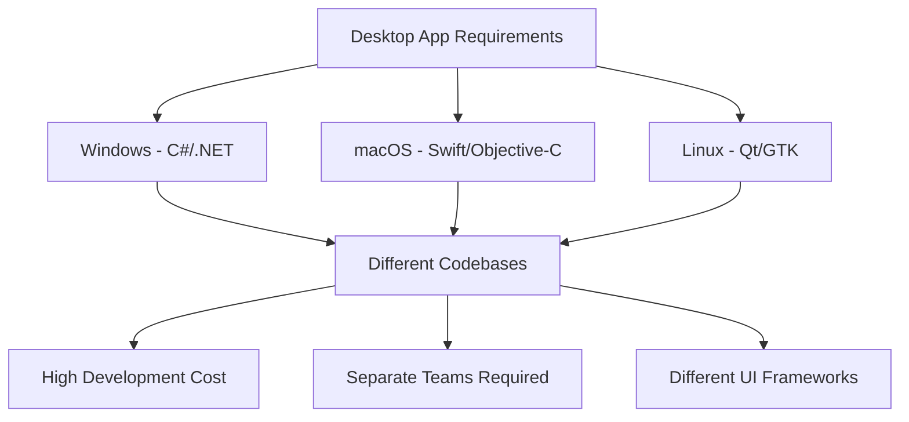

### **Solution: Electron.js**

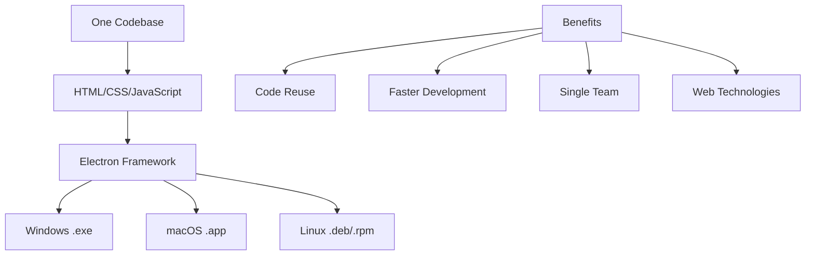

### **🏆 Success Stories**
- **VS Code** - Microsoft's code editor (1B+ downloads)
- **Discord** - Gaming communication platform (150M+ users)
- **Slack** - Team collaboration tool (20M+ users)
- **WhatsApp Desktop** - Meta's messaging app
- **Figma Desktop** - Design collaboration tool

---

## Slide 3: 🏗️ Electron Architecture Deep Dive

### **Core Architecture**

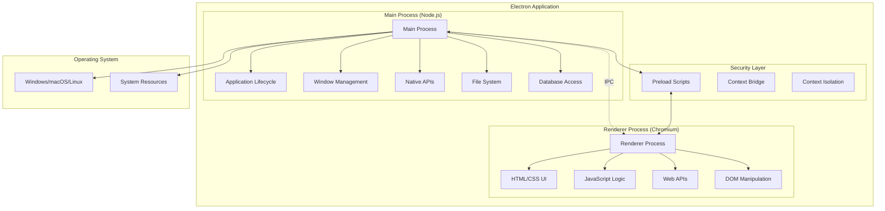

### **🔑 Key Concepts**
- **Main Process** = แอพพลิเคชันหลัก (1 ตัว)
- **Renderer Process** = หน้าต่างแต่ละหน้า (หลายตัวได้)
- **IPC** = การสื่อสารระหว่าง processes
- **Preload Scripts** = ตัวกลางความปลอดภัย

---

## Slide 4: 🆚 Web vs Desktop Applications

### **Feature Comparison**

| Feature | 🌐 Web Apps | 🖥️ Desktop Apps | ⚡ Electron Apps |
|---------|-------------|-----------------|------------------|
| **File Access** | ❌ Limited | ✅ Full Access | ✅ Full Access |
| **Notifications** | ⚠️ Browser Only | ✅ Native OS | ✅ Native OS |
| **System Tray** | ❌ No | ✅ Yes | ✅ Yes |
| **Offline Mode** | ⚠️ Limited | ✅ Full | ✅ Full |
| **Auto Updates** | ✅ Automatic | ⚠️ Complex | ✅ Built-in |
| **Cross Platform** | ✅ Universal | ❌ OS Specific | ✅ Universal |
| **Development Speed** | ✅ Fast | ❌ Slow | ✅ Fast |
| **Performance** | ⚠️ Browser Dependent | ✅ Native | ⚠️ Good |
| **Resource Usage** | ✅ Low | ✅ Low | ❌ Higher |

### **💡 When to Use Electron**
- ✅ Cross-platform requirements
- ✅ Web development team
- ✅ Rapid prototyping
- ✅ Rich UI/UX needs
- ✅ Integration with web services

### **❌ When NOT to Use Electron**
- ❌ High-performance applications (games, video editing)
- ❌ Resource-constrained environments
- ❌ Native platform-specific features critical
- ❌ Mobile-first applications

---

## Slide 5: 🚀 Getting Started - Project Setup

### **Installation Process**

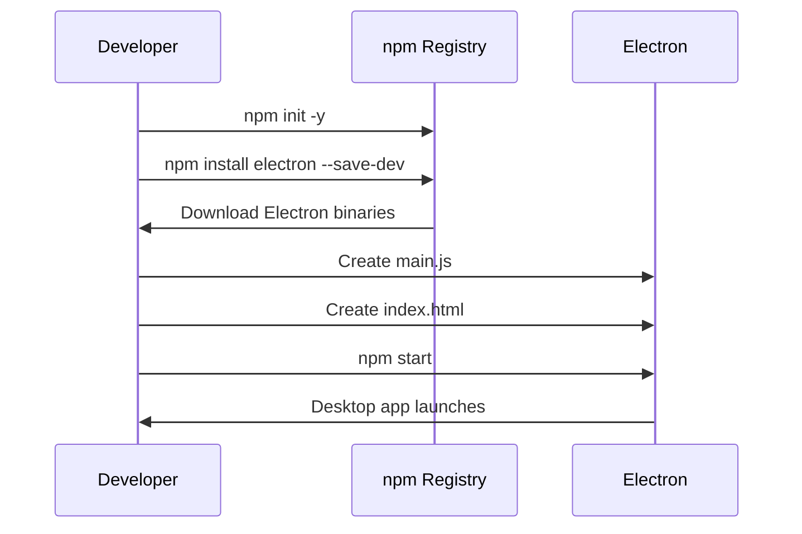

### **📁 Basic Project Structure**
```
my-electron-app/
├── package.json          # NPM configuration
├── main.js              # Main process entry point
├── preload.js           # Security bridge (optional)
├── index.html           # Renderer UI
├── assets/              # Images, icons, etc.
│   └── icon.png
└── node_modules/        # Dependencies
    └── electron/
```

### **📄 Essential package.json**
```json
{
  "name": "my-electron-app",
  "version": "1.0.0",
  "main": "main.js",
  "scripts": {
    "start": "electron .",
    "dev": "electron . --dev"
  },
  "devDependencies": {
    "electron": "^27.0.0"
  }
}
```

---

## Slide 6: 🖥️ Main Process Fundamentals

### **Main Process Responsibilities**

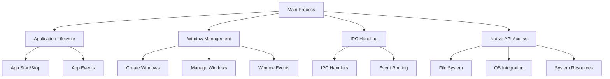

### **🔧 Basic Main Process Code**
```javascript
const { app, BrowserWindow } = require('electron');
const path = require('path');

let mainWindow;

function createWindow() {
  mainWindow = new BrowserWindow({
    width: 800,
    height: 600,
    webPreferences: {
      nodeIntegration: false,     // Security
      contextIsolation: true,     // Security
      preload: path.join(__dirname, 'preload.js')
    }
  });

  mainWindow.loadFile('index.html');
}

app.whenReady().then(createWindow);

app.on('window-all-closed', () => {
  if (process.platform !== 'darwin') {
    app.quit();
  }
});
```

### **🎯 Key APIs**
- `app` - Application control
- `BrowserWindow` - Window creation
- `ipcMain` - IPC communication
- `Menu` - Application menus
- `Tray` - System tray integration

---

## Slide 7: 🎨 Renderer Process Fundamentals

### **Renderer Process Architecture**

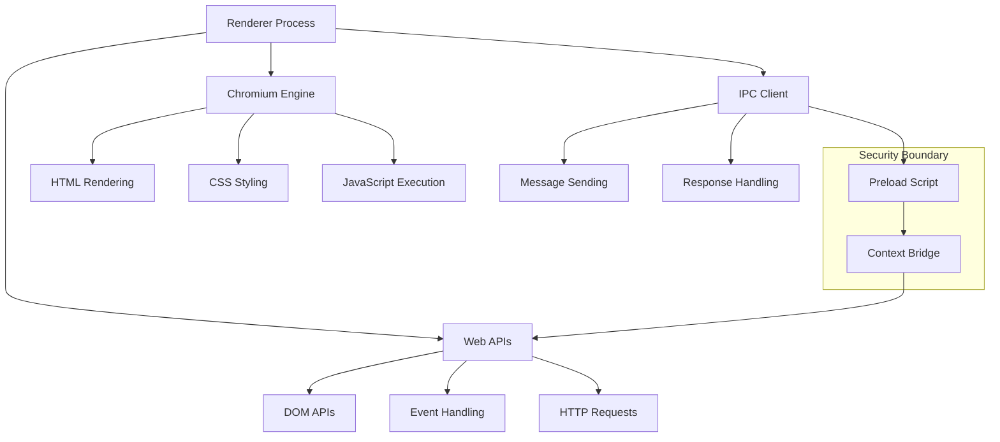

### **🎨 Basic HTML Structure**
```html
<!DOCTYPE html>
<html>
<head>
  <title>My Electron App</title>
  <style>
    body { 
      font-family: -apple-system, BlinkMacSystemFont, 'Segoe UI';
      margin: 0; padding: 20px;
    }
  </style>
</head>
<body>
  <h1>Hello Electron!</h1>
  <button onclick="callMainProcess()">
    Call Main Process
  </button>
  
  <script>
    function callMainProcess() {
      // Use exposed APIs via preload
      window.electronAPI.doSomething();
    }
  </script>
</body>
</html>
```

### **🔑 Key Limitations**
- ❌ No direct Node.js access (security)
- ❌ No direct file system access
- ✅ Web APIs available
- ✅ IPC communication via preload

---

## Slide 8: 🔒 Security Best Practices

### **Security Architecture**

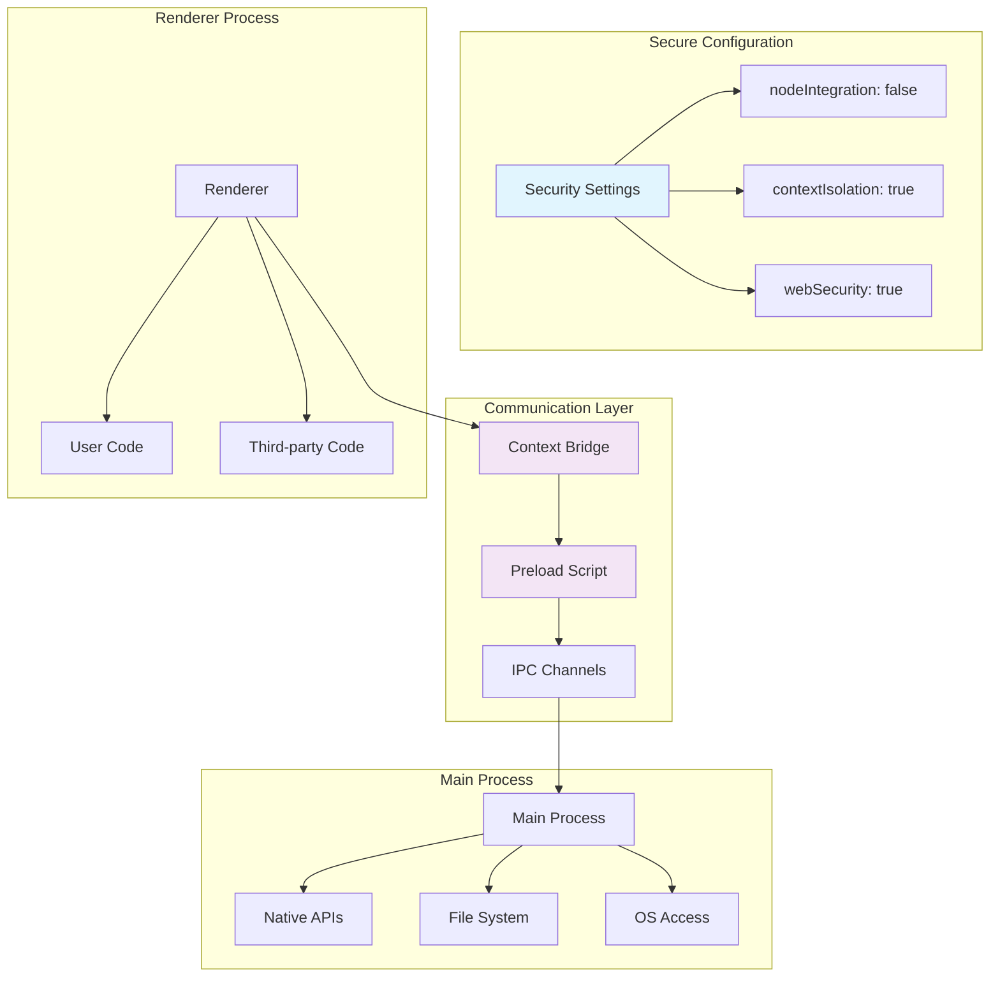

### **🛡️ Security Configuration**
```javascript
// ✅ SECURE Configuration
new BrowserWindow({
  webPreferences: {
    nodeIntegration: false,        // Prevent Node.js access
    contextIsolation: true,        // Isolate contexts
    enableRemoteModule: false,     // Disable remote
    allowRunningInsecureContent: false,
    experimentalFeatures: false,
    preload: path.join(__dirname, 'preload.js')
  }
});

// ❌ INSECURE Configuration (DON'T DO THIS)
new BrowserWindow({
  webPreferences: {
    nodeIntegration: true,         // DANGEROUS!
    contextIsolation: false,       // DANGEROUS!
    webSecurity: false            // DANGEROUS!
  }
});
```

### **🌉 Secure Preload Script**
```javascript
const { contextBridge, ipcRenderer } = require('electron');

// ✅ Expose only safe APIs
contextBridge.exposeInMainWorld('electronAPI', {
  openFile: () => ipcRenderer.invoke('dialog:openFile'),
  saveFile: (data) => ipcRenderer.invoke('dialog:saveFile', data),
  // ❌ DON'T expose dangerous functions
  // executeCommand: (cmd) => require('child_process').exec(cmd)
});
```

---

## Slide 9: 🔄 IPC Communication Patterns

### **IPC Communication Flow**

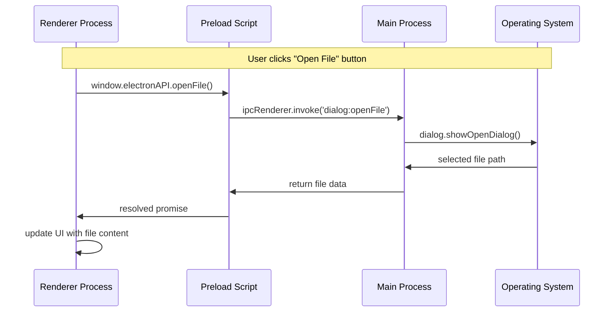

### **📡 IPC Patterns**

**1. Invoke/Handle Pattern (Recommended)**
```javascript
// Main Process
ipcMain.handle('get-user-data', async (event, userId) => {
  const userData = await database.getUser(userId);
  return userData;
});

// Preload
contextBridge.exposeInMainWorld('api', {
  getUserData: (userId) => ipcRenderer.invoke('get-user-data', userId)
});

// Renderer
const userData = await window.api.getUserData(123);
```

**2. Send/On Pattern (Events)**
```javascript
// Main Process sends event
mainWindow.webContents.send('status-update', { status: 'online' });

// Preload listens
contextBridge.exposeInMainWorld('api', {
  onStatusUpdate: (callback) => 
    ipcRenderer.on('status-update', (event, data) => callback(data))
});

// Renderer handles event
window.api.onStatusUpdate((data) => {
  console.log('Status:', data.status);
});
```

---

## Slide 10: 📁 File System Integration

### **File Operations Architecture**

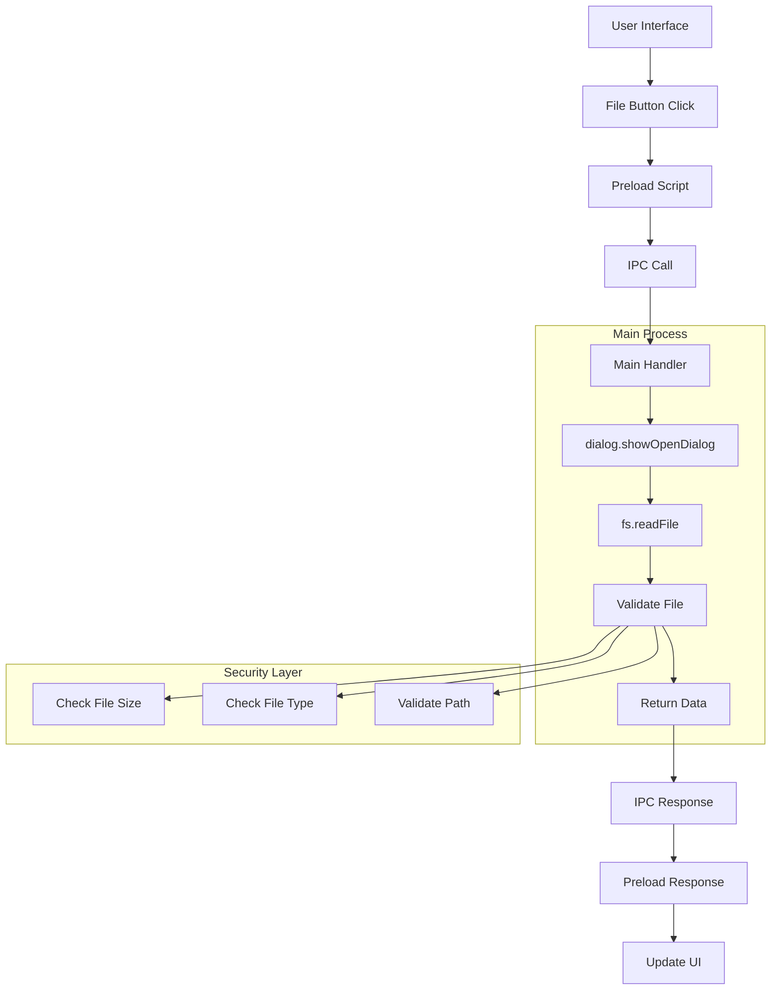

### **📂 File Dialog Implementation**
```javascript
// Main Process - File Operations
ipcMain.handle('dialog:openFile', async () => {
  const { canceled, filePaths } = await dialog.showOpenDialog({
    properties: ['openFile'],
    filters: [
      { name: 'Text Files', extensions: ['txt', 'md'] },
      { name: 'All Files', extensions: ['*'] }
    ]
  });
  
  if (canceled) return { canceled: true };
  
  const filePath = filePaths[0];
  const content = await fs.readFile(filePath, 'utf8');
  
  return {
    success: true,
    path: filePath,
    content: content,
    size: content.length
  };
});
```

### **💾 Save File Implementation**
```javascript
// Main Process - Save File
ipcMain.handle('dialog:saveFile', async (event, data) => {
  const { canceled, filePath } = await dialog.showSaveDialog({
    defaultPath: 'document.txt',
    filters: [
      { name: 'Text Files', extensions: ['txt'] }
    ]
  });
  
  if (canceled) return { canceled: true };
  
  await fs.writeFile(filePath, data, 'utf8');
  return { success: true, path: filePath };
});
```

---

## Slide 11: 🔔 Native Notifications

### **Notification System Architecture**

```mermaid
graph TD
    APP[Application Event] --> MP[Main Process]
    MP --> NOT[new Notification()]
    NOT --> OS[Operating System]
    
    subgraph "Notification Features"
        OS --> DIS[Display Notification]
        OS --> SND[Play Sound]
        OS --> ICN[Show Icon]
        OS --> BTN[Action Buttons]
    end
    
    DIS --> USR[User Interaction]
    USR --> CLK[Click Event]
    CLK --> FOC[Focus App]
    FOC --> APP
    
    subgraph "Platform Specific"
        WIN[Windows Toast]
        MAC[macOS Banner]
        LIN[Linux Desktop]
    end
    
    OS --> WIN
    OS --> MAC  
    OS --> LIN
```

### **🔔 Notification Implementation**
```javascript
// Main Process - Create Notification
function showNotification(title, body, urgent = false) {
  const notification = new Notification({
    title: title,
    body: body,
    icon: path.join(__dirname, 'assets/icon.png'),
    urgency: urgent ? 'critical' : 'normal',
    actions: [
      { type: 'button', text: 'View' },
      { type: 'button', text: 'Dismiss' }
    ]
  });
  
  notification.show();
  
  notification.on('click', () => {
    mainWindow.show();
    mainWindow.focus();
  });
  
  return notification;
}

// IPC Handler
ipcMain.handle('show-notification', (event, data) => {
  return showNotification(data.title, data.body, data.urgent);
});
```

### **📱 Agent Wallboard Use Cases**
- 📞 **Incoming Call** notifications
- 🔄 **Status Change** alerts
- ⚠️ **System Alert** warnings
- 📊 **Performance** milestone notifications

---

## Slide 12: 🖱️ System Tray Integration

### **System Tray Architecture**

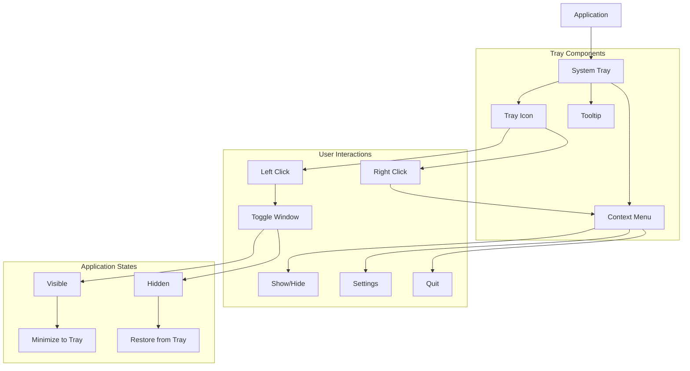

### **🖱️ System Tray Implementation**
```javascript
// Main Process - System Tray
const { Tray, Menu, nativeImage } = require('electron');

let tray;

function createTray() {
  const icon = nativeImage.createFromPath(
    path.join(__dirname, 'assets/tray-icon.png')
  );
  
  tray = new Tray(icon);
  
  const contextMenu = Menu.buildFromTemplate([
    {
      label: 'Show Wallboard',
      click: () => {
        mainWindow.show();
        mainWindow.focus();
      }
    },
    {
      label: 'Quick Status',
      submenu: [
        { label: 'Available', click: () => changeStatus('Available') },
        { label: 'Busy', click: () => changeStatus('Busy') },
        { label: 'Break', click: () => changeStatus('Break') }
      ]
    },
    { type: 'separator' },
    {
      label: 'Quit',
      click: () => app.quit()
    }
  ]);
  
  tray.setContextMenu(contextMenu);
  tray.setToolTip('Agent Wallboard');
  
  // Click to toggle window
  tray.on('click', () => {
    if (mainWindow.isVisible()) {
      mainWindow.hide();
    } else {
      mainWindow.show();
    }
  });
}
```

---

## Slide 13: 🌐 External API Integration

### **API Integration Architecture**

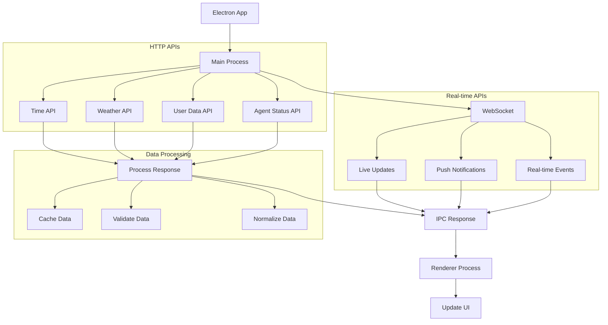

### **🌍 HTTP API Example**
```javascript
// Main Process - API Call
const https = require('https');

ipcMain.handle('get-time', async () => {
  return new Promise((resolve, reject) => {
    https.get('https://worldtimeapi.org/api/timezone/Asia/Bangkok', (res) => {
      let data = '';
      
      res.on('data', (chunk) => data += chunk);
      res.on('end', () => {
        try {
          const timeData = JSON.parse(data);
          resolve({
            success: true,
            datetime: timeData.datetime,
            timezone: timeData.timezone
          });
        } catch (error) {
          reject(error);
        }
      });
    }).on('error', reject);
  });
});
```

### **⚡ WebSocket Integration**
```javascript
// Renderer Process - WebSocket Client
const websocket = new WebSocket('wss://api.example.com/websocket');

websocket.onmessage = (event) => {
  const data = JSON.parse(event.data);
  
  if (data.type === 'agent_status_update') {
    updateAgentStatus(data.agentId, data.status);
    showNotification(`Agent ${data.agentId} is now ${data.status}`);
  }
};

// Send status update
function updateMyStatus(newStatus) {
  websocket.send(JSON.stringify({
    type: 'status_change',
    agentId: currentAgent.id,
    status: newStatus,
    timestamp: new Date().toISOString()
  }));
}
```

---

## Slide 14: 📦 Building and Distribution

### **Build Process Architecture**

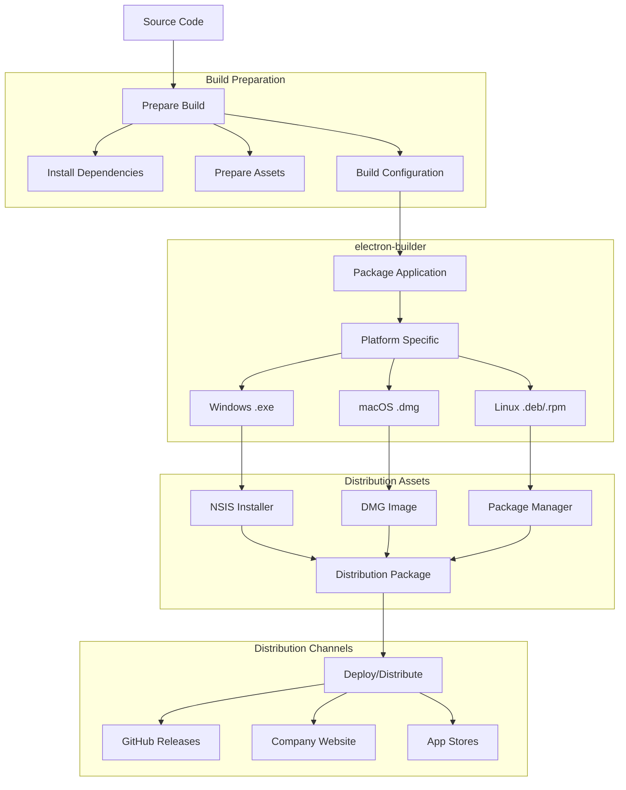

### **📋 Build Configuration**
```json
{
  "build": {
    "appId": "com.company.agent-wallboard",
    "productName": "Agent Wallboard",
    "directories": {
      "output": "dist"
    },
    "files": [
      "main.js",
      "preload.js",
      "index.html",
      "assets/**/*"
    ],
    "win": {
      "target": "nsis",
      "icon": "build/icon.ico"
    },
    "mac": {
      "target": "dmg", 
      "icon": "build/icon.icns"
    },
    "linux": {
      "target": "deb",
      "icon": "build/icon.png"
    }
  }
}
```

### **🚀 Build Commands**
```bash
# Install electron-builder
npm install electron-builder --save-dev

# Build for current platform
npm run build

# Build for specific platforms
npm run build:win
npm run build:mac
npm run build:linux

# Build for all platforms
npm run build:all
```

---

## Slide 15: 🎯 Agent Wallboard Case Study

### **Agent Wallboard System Architecture**

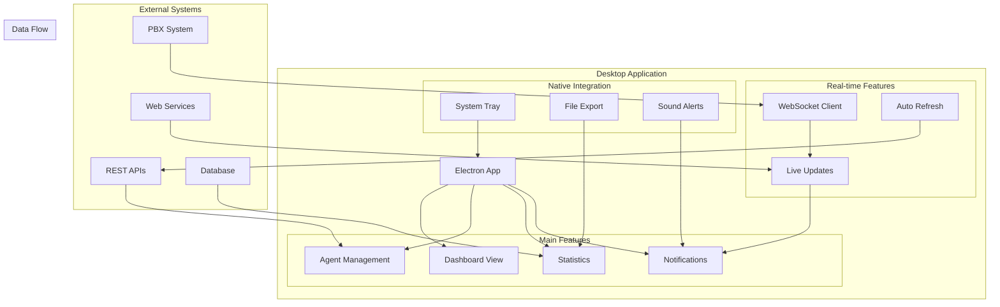

### **📊 Key Features Implementation**

**Real-time Agent Status:**
```javascript
// WebSocket connection for live updates
const ws = new WebSocket('wss://pbx.company.com/agents');

ws.onmessage = (event) => {
  const update = JSON.parse(event.data);
  
  if (update.type === 'agent_status') {
    updateAgentDisplay(update.agentId, update.status);
    
    if (update.status === 'Available') {
      showNotification(`${update.agentName} is now available`);
    }
  }
};
```

**System Tray Quick Actions:**
```javascript
// Quick status change from system tray
const trayMenu = Menu.buildFromTemplate([
  {
    label: 'Set Status',
    submenu: [
      { 
        label: 'Available', 
        click: () => updateAgentStatus('Available')
      },
      { 
        label: 'Busy', 
        click: () => updateAgentStatus('Busy')
      },
      { 
        label: 'Break', 
        click: () => updateAgentStatus('Break')
      }
    ]
  }
]);
```

---

## Slide 16: 🔄 Real-time Data Flow

### **Real-time Communication Pattern**

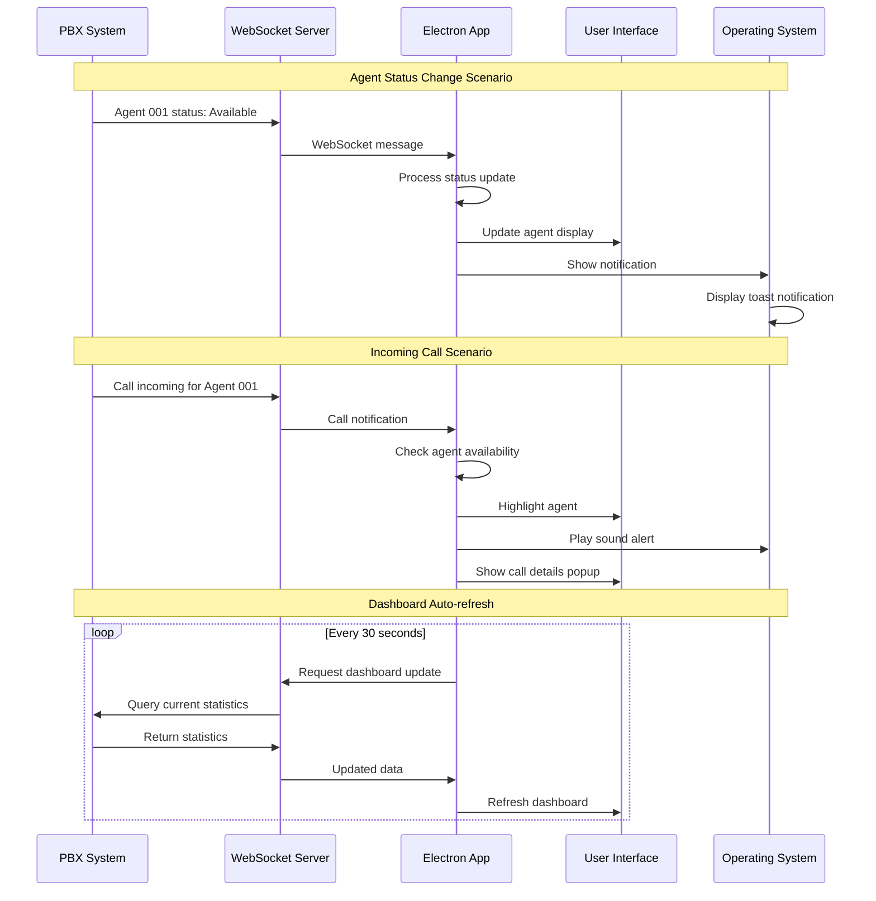

### **📈 Performance Considerations**

**Data Optimization:**
```javascript
// Efficient data handling
class AgentDataManager {
  constructor() {
    this.agents = new Map();
    this.updateQueue = [];
    this.batchUpdateInterval = null;
  }
  
  // Batch updates to prevent UI flooding
  queueUpdate(agentId, data) {
    this.updateQueue.push({ agentId, data, timestamp: Date.now() });
    
    if (!this.batchUpdateInterval) {
      this.batchUpdateInterval = setTimeout(() => {
        this.processBatchUpdates();
        this.batchUpdateInterval = null;
      }, 100); // 100ms batch window
    }
  }
  
  processBatchUpdates() {
    // Process only latest update per agent
    const latestUpdates = new Map();
    
    this.updateQueue.forEach(update => {
      const existing = latestUpdates.get(update.agentId);
      if (!existing || update.timestamp > existing.timestamp) {
        latestUpdates.set(update.agentId, update);
      }
    });
    
    // Apply updates to UI
    latestUpdates.forEach(update => {
      this.updateAgentUI(update.agentId, update.data);
    });
    
    this.updateQueue = [];
  }
}
```

---

## Slide 17: 🛠️ Development Workflow

### **Development Process**

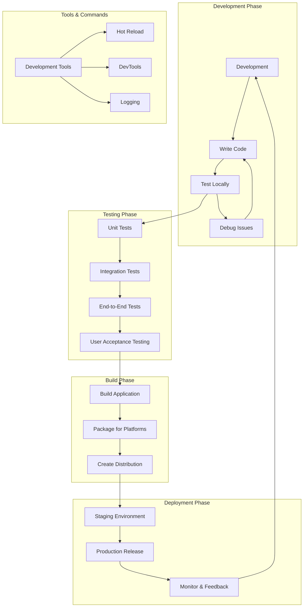

### **🔧 Development Scripts**
```json
{
  "scripts": {
    "dev": "electron . --dev",
    "start": "electron .",
    "debug": "electron --inspect=9229 .",
    "test": "jest",
    "test:e2e": "spectron",
    "lint": "eslint src/",
    "build": "electron-builder",
    "build:dev": "electron-builder --dir",
    "pack": "electron-builder --dir",
    "dist": "electron-builder --publish=never",
    "release": "electron-builder --publish=always"
  }
}
```

### **🐛 Debugging Techniques**
```javascript
// Main Process Debugging
console.log('[MAIN]', 'Application started');

// Renderer Process Debugging  
if (process.env.NODE_ENV === 'development') {
  mainWindow.webContents.openDevTools();
}

// IPC Debugging
ipcMain.handle('debug-info', () => {
  return {
    platform: process.platform,
    electronVersion: process.versions.electron,
    nodeVersion: process.versions.node,
    chromeVersion: process.versions.chrome
  };
});

// Error Handling
process.on('uncaughtException', (error) => {
  console.error('Uncaught Exception:', error);
  // Log to file or crash reporting service
});
```

---

## Slide 18: 🔧 Advanced Features

### **Advanced Electron Capabilities**

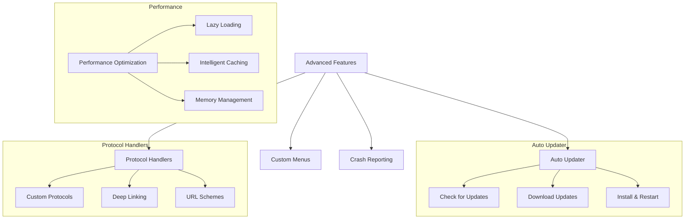

### **🔄 Auto-Updater Implementation**
```javascript
const { autoUpdater } = require('electron-updater');

// Configure auto-updater
autoUpdater.checkForUpdatesAndNotify();

autoUpdater.on('checking-for-update', () => {
  console.log('Checking for update...');
});

autoUpdater.on('update-available', (info) => {
  console.log('Update available:', info.version);
  showNotification('Update Available', 
    `Version ${info.version} is available for download`);
});

autoUpdater.on('update-downloaded', (info) => {
  console.log('Update downloaded:', info.version);
  
  dialog.showMessageBox({
    type: 'info',
    title: 'Update Ready',
    message: 'Update downloaded. Restart to apply?',
    buttons: ['Restart Now', 'Later']
  }).then((result) => {
    if (result.response === 0) {
      autoUpdater.quitAndInstall();
    }
  });
});
```

### **🎛️ Custom Menu System**
```javascript
const template = [
  {
    label: 'File',
    submenu: [
      {
        label: 'New Agent',
        accelerator: 'CmdOrCtrl+N',
        click: () => {
          mainWindow.webContents.send('menu-action', 'new-agent');
        }
      },
      {
        label: 'Export Report',
        accelerator: 'CmdOrCtrl+E',
        click: async () => {
          const result = await dialog.showSaveDialog({
            filters: [{ name: 'CSV Files', extensions: ['csv'] }]
          });
          
          if (!result.canceled) {
            exportReport(result.filePath);
          }
        }
      }
    ]
  },
  {
    label: 'View',
    submenu: [
      { role: 'reload' },
      { role: 'forceReload' },
      { role: 'toggleDevTools' },
      { type: 'separator' },
      { role: 'resetZoom' },
      { role: 'zoomIn' },
      { role: 'zoomOut' }
    ]
  }
];

const menu = Menu.buildFromTemplate(template);
Menu.setApplicationMenu(menu);
```

---

## Slide 19: 📊 Performance Optimization

### **Performance Optimization Strategies**

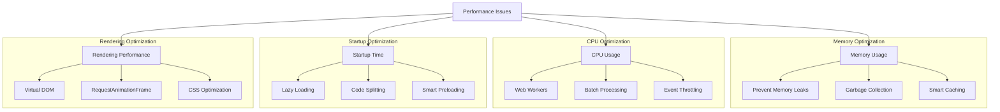

### **🚀 Performance Best Practices**
```javascript
// 1. Efficient Data Handling
class PerformantDataManager {
  constructor() {
    this.cache = new Map();
    this.updateBatch = [];
    this.batchTimer = null;
  }
  
  // Batch DOM updates
  batchUpdate(updates) {
    this.updateBatch.push(...updates);
    
    if (!this.batchTimer) {
      this.batchTimer = requestAnimationFrame(() => {
        this.processBatch();
        this.batchTimer = null;
      });
    }
  }
  
  // Use Web Workers for heavy computation
  async heavyComputation(data) {
    return new Promise((resolve) => {
      const worker = new Worker('computational-worker.js');
      worker.postMessage(data);
      worker.onmessage = (e) => {
        resolve(e.data);
        worker.terminate();
      };
    });
  }
}

// 2. Memory Leak Prevention
class ComponentManager {
  constructor() {
    this.listeners = [];
    this.intervals = [];
    this.timeouts = [];
  }
  
  addListener(element, event, handler) {
    element.addEventListener(event, handler);
    this.listeners.push({ element, event, handler });
  }
  
  cleanup() {
    // Remove all event listeners
    this.listeners.forEach(({ element, event, handler }) => {
      element.removeEventListener(event, handler);
    });
    
    // Clear all intervals and timeouts
    this.intervals.forEach(clearInterval);
    this.timeouts.forEach(clearTimeout);
    
    // Reset arrays
    this.listeners = [];
    this.intervals = [];
    this.timeouts = [];
  }
}

// 3. Efficient UI Updates
function throttledUpdate(fn, delay = 16) {
  let timeoutId;
  let lastExecTime = 0;
  
  return function (...args) {
    const currentTime = Date.now();
    
    if (currentTime - lastExecTime > delay) {
      fn.apply(this, args);
      lastExecTime = currentTime;
    } else {
      clearTimeout(timeoutId);
      timeoutId = setTimeout(() => {
        fn.apply(this, args);
        lastExecTime = Date.now();
      }, delay - (currentTime - lastExecTime));
    }
  };
}
```

---

## Slide 20: 🧪 Testing Strategies

### **Testing Architecture**

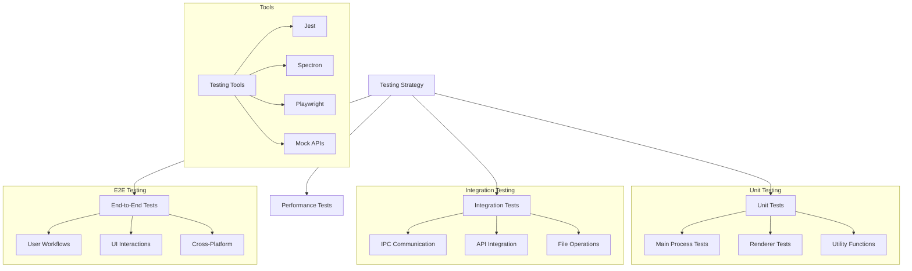

### **🧪 Testing Implementation**
```javascript
// Unit Test Example (Jest)
// tests/main.test.js
const { ipcMain } = require('electron');
const { handleAgentStatusUpdate } = require('../src/agent-manager');

describe('Agent Status Management', () => {
  test('should update agent status correctly', async () => {
    const mockAgent = {
      id: 'AG001',
      name: 'Test Agent',
      status: 'Available'
    };
    
    const result = await handleAgentStatusUpdate(mockAgent.id, 'Busy');
    
    expect(result.success).toBe(true);
    expect(result.newStatus).toBe('Busy');
  });
  
  test('should reject invalid status', async () => {
    const result = await handleAgentStatusUpdate('AG001', 'InvalidStatus');
    
    expect(result.success).toBe(false);
    expect(result.error).toContain('Invalid status');
  });
});

// E2E Test Example (Spectron)
// tests/e2e.test.js
const Application = require('spectron').Application;
const path = require('path');

describe('Agent Wallboard E2E', () => {
  let app;
  
  beforeEach(async () => {
    app = new Application({
      path: path.join(__dirname, '../node_modules/.bin/electron'),
      args: [path.join(__dirname, '../main.js')]
    });
    
    await app.start();
  });
  
  afterEach(async () => {
    if (app && app.isRunning()) {
      await app.stop();
    }
  });
  
  test('should display agent list', async () => {
    await app.client.waitUntilWindowLoaded();
    
    const agentList = await app.client.$('#agent-list');
    expect(await agentList.isDisplayed()).toBe(true);
    
    const agents = await app.client.$('.agent-item');
    expect(agents.length).toBeGreaterThan(0);
  });
  
  test('should change agent status', async () => {
    await app.client.waitUntilWindowLoaded();
    
    // Click on first agent
    await app.client.click('.agent-item:first-child');
    
    // Change status to Busy
    await app.client.click('[data-status="Busy"]');
    
    // Verify status change
    const statusElement = await app.client.$('.agent-item:first-child .status');
    const statusText = await statusElement.getText();
    expect(statusText).toContain('Busy');
  });
});
```

---

## Slide 21: 🚨 Error Handling & Debugging

### **Error Handling Strategy**

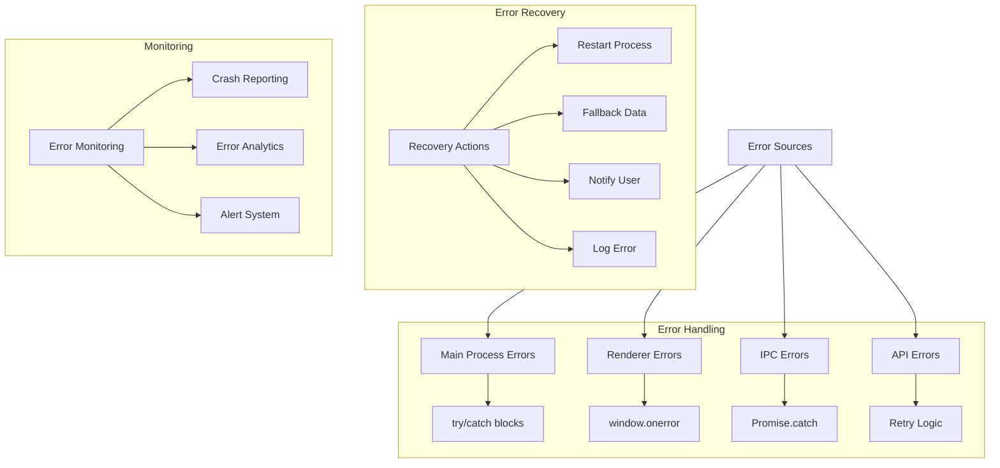

### **🛠️ Error Handling Implementation**
```javascript
// Main Process Error Handling
process.on('uncaughtException', (error) => {
  console.error('Uncaught Exception in Main Process:', error);
  
  // Log to file
  logErrorToFile(error);
  
  // Send to crash reporting service
  sendCrashReport(error);
  
  // Show user-friendly error dialog
  dialog.showErrorBox('Unexpected Error', 
    'An unexpected error occurred. The application will restart.');
  
  // Graceful restart
  app.relaunch();
  app.exit(0);
});

// IPC Error Handling
ipcMain.handle('agent-operation', async (event, data) => {
  try {
    const result = await performAgentOperation(data);
    return { success: true, data: result };
  } catch (error) {
    console.error('Agent operation failed:', error);
    
    return {
      success: false,
      error: {
        message: error.message,
        code: error.code || 'UNKNOWN_ERROR',
        timestamp: new Date().toISOString()
      }
    };
  }
});

// Renderer Process Error Handling
window.addEventListener('error', (event) => {
  console.error('Renderer Error:', event.error);
  
  // Send error to main process for logging
  window.electronAPI.logError({
    message: event.error.message,
    stack: event.error.stack,
    filename: event.filename,
    lineno: event.lineno,
    colno: event.colno
  });
});

// Promise Rejection Handling
window.addEventListener('unhandledrejection', (event) => {
  console.error('Unhandled Promise Rejection:', event.reason);
  
  // Prevent default browser handling
  event.preventDefault();
  
  // Log and handle gracefully
  window.electronAPI.logError({
    type: 'unhandled_rejection',
    reason: event.reason,
    promise: event.promise
  });
});

// API Error Handling with Retry
async function callAPIWithRetry(apiCall, maxRetries = 3) {
  for (let attempt = 1; attempt <= maxRetries; attempt++) {
    try {
      return await apiCall();
    } catch (error) {
      console.warn(`API call attempt ${attempt} failed:`, error);
      
      if (attempt === maxRetries) {
        throw new Error(`API call failed after ${maxRetries} attempts: ${error.message}`);
      }
      
      // Exponential backoff
      const delay = Math.pow(2, attempt) * 1000;
      await new Promise(resolve => setTimeout(resolve, delay));
    }
  }
}
```

---

## Slide 22: 🔐 Security Deep Dive

### **Security Architecture**

```mermaid
graph TD
    SECURITY[Security Layers] --> INPUT[Input Validation]
    SECURITY --> ISOLATION[Context Isolation]
    SECURITY --> COMM[Secure Communication]
    SECURITY --> STORAGE[Secure Storage]
    
    subgraph "Input Validation"
        INPUT --> SANIT[Data Sanitization]
        INPUT --> VALID[Schema Validation]
        INPUT --> FILTER[Content Filtering]
    end
    
    subgraph "Context Isolation"
        ISOLATION --> BRIDGE[Context Bridge]
        ISOLATION --> PRELOAD[Preload Scripts]
        ISOLATION --> SANDBOX[Sandboxing]
    end
    
    subgraph "Secure Communication"
        COMM --> HTTPS[HTTPS Only]
        COMM --> WSS[WSS WebSockets]
        COMM --> TOKEN[Token Authentication]
        COMM --> CERT[Certificate Validation]
    end
    
    subgraph "Secure Storage"
        STORAGE --> ENCRYPT[Encryption at Rest]
        STORAGE --> KEYCHAIN[OS Keychain]
        STORAGE --> TEMP[Secure Temp Files]
    end
```

### **🔒 Security Implementation**
```javascript
// Secure Configuration
const secureConfig = {
  webPreferences: {
    nodeIntegration: false,
    contextIsolation: true,
    enableRemoteModule: false,
    allowRunningInsecureContent: false,
    experimentalFeatures: false,
    webSecurity: true,
    preload: path.join(__dirname, 'preload.js')
  }
};

// Input Validation
function validateAgentData(data) {
  const schema = {
    id: { type: 'string', pattern: /^AG\d{3}$/ },
    name: { type: 'string', maxLength: 100 },
    status: { type: 'string', enum: ['Available', 'Busy', 'Break', 'Offline'] },
    extension: { type: 'string', pattern: /^\d{4}$/ }
  };
  
  for (const [key, rules] of Object.entries(schema)) {
    const value = data[key];
    
    if (rules.type && typeof value !== rules.type) {
      throw new Error(`Invalid type for ${key}`);
    }
    
    if (rules.pattern && !rules.pattern.test(value)) {
      throw new Error(`Invalid format for ${key}`);
    }
    
    if (rules.maxLength && value.length > rules.maxLength) {
      throw new Error(`${key} too long`);
    }
    
    if (rules.enum && !rules.enum.includes(value)) {
      throw new Error(`Invalid value for ${key}`);
    }
  }
  
  return true;
}

// Secure API Communication
class SecureAPIClient {
  constructor(baseURL, apiKey) {
    this.baseURL = baseURL;
    this.apiKey = apiKey;
    this.timeout = 30000;
  }
  
  async makeRequest(endpoint, data = null) {
    const url = `${this.baseURL}${endpoint}`;
    
    // Validate URL
    if (!url.startsWith('https://')) {
      throw new Error('Only HTTPS URLs are allowed');
    }
    
    const options = {
      method: data ? 'POST' : 'GET',
      headers: {
        'Authorization': `Bearer ${this.apiKey}`,
        'Content-Type': 'application/json',
        'User-Agent': 'AgentWallboard/1.0.0'
      },
      timeout: this.timeout
    };
    
    if (data) {
      // Sanitize data before sending
      options.body = JSON.stringify(this.sanitizeData(data));
    }
    
    const response = await fetch(url, options);
    
    if (!response.ok) {
      throw new Error(`API Error: ${response.status} ${response.statusText}`);
    }
    
    return await response.json();
  }
  
  sanitizeData(data) {
    // Remove dangerous properties
    const dangerous = ['__proto__', 'constructor', 'prototype'];
    const sanitized = {};
    
    for (const [key, value] of Object.entries(data)) {
      if (!dangerous.includes(key)) {
        sanitized[key] = value;
      }
    }
    
    return sanitized;
  }
}
```

---

## Slide 23: 📱 Mobile Integration

### **Cross-Platform Ecosystem**

```mermaid
graph TD
    ECOSYSTEM[Cross-Platform Ecosystem] --> DESKTOP[Desktop App]
    ECOSYSTEM --> WEB[Web App]
    ECOSYSTEM --> MOBILE[Mobile App]
    ECOSYSTEM --> API[Backend APIs]
    
    subgraph "Desktop (Electron)"
        DESKTOP --> ELECTRON[Electron App]
        ELECTRON --> NATIVE[Native Features]
        ELECTRON --> OFFLINE[Offline Capability]
    end
    
    subgraph "Web Platform"
        WEB --> PWA[Progressive Web App]
        PWA --> SW[Service Workers]
        PWA --> CACHE[App Cache]
    end
    
    subgraph "Mobile Platform"
        MOBILE --> REACT_NATIVE[React Native]
        MOBILE --> IONIC[Ionic/Cordova]
        MOBILE --> FLUTTER[Flutter]
    end
    
    subgraph "Shared Components"
        SHARED[Shared Codebase]
        SHARED --> LOGIC[Business Logic]
        SHARED --> UI[UI Components]
        SHARED --> DATA[Data Models]
    end
    
    DESKTOP --> SHARED
    WEB --> SHARED
    MOBILE --> SHARED
    
    API --> DESKTOP
    API --> WEB
    API --> MOBILE
```

### **🔄 Data Synchronization**
```javascript
// Shared Data Synchronization Service
class DataSyncService {
  constructor() {
    this.syncQueue = [];
    this.isOnline = navigator.onLine;
    this.lastSync = localStorage.getItem('lastSync');
    
    // Listen for online/offline events
    window.addEventListener('online', () => this.handleOnline());
    window.addEventListener('offline', () => this.handleOffline());
  }
  
  async syncAgentData() {
    try {
      // Get local changes
      const localChanges = this.getLocalChanges();
      
      // Send to server
      if (localChanges.length > 0) {
        await this.uploadChanges(localChanges);
      }
      
      // Get server updates
      const serverUpdates = await this.getServerUpdates(this.lastSync);
      
      // Apply server updates locally
      if (serverUpdates.length > 0) {
        await this.applyServerUpdates(serverUpdates);
      }
      
      this.lastSync = new Date().toISOString();
      localStorage.setItem('lastSync', this.lastSync);
      
    } catch (error) {
      console.error('Sync failed:', error);
      
      // Queue for retry when online
      this.queueForRetry();
    }
  }
  
  handleOnline() {
    this.isOnline = true;
    console.log('Back online - starting sync...');
    this.syncAgentData();
  }
  
  handleOffline() {
    this.isOnline = false;
    console.log('Gone offline - queuing changes...');
  }
  
  async uploadChanges(changes) {
    const response = await fetch('/api/sync/upload', {
      method: 'POST',
      headers: { 'Content-Type': 'application/json' },
      body: JSON.stringify({ changes })
    });
    
    if (!response.ok) {
      throw new Error('Upload failed');
    }
    
    return await response.json();
  }
  
  async getServerUpdates(since) {
    const response = await fetch(`/api/sync/updates?since=${since}`);
    
    if (!response.ok) {
      throw new Error('Failed to get updates');
    }
    
    return await response.json();
  }
}
```

---

# Slides 24-30: Advanced Electron Topics

---

## Slide 24: 🎨 UI/UX Best Practices สำหรับ Desktop Apps

### **Desktop UI Design Principles**

```mermaid
graph TD
    DESIGN[Desktop UI Design] --> NATIVE[Native Look & Feel]
    DESIGN --> RESPONSIVE[Responsive Design]
    DESIGN --> ACCESS[Accessibility]
    DESIGN --> PERFORMANCE[Performance UX]
    
    subgraph "Native Integration"
        NATIVE --> OS_THEME[OS Theme Adaptation]
        NATIVE --> SHORTCUTS[Keyboard Shortcuts]
        NATIVE --> CONTEXT[Context Menus]
        NATIVE --> DRAG[Drag & Drop]
    end
    
    subgraph "Responsive Behavior"
        RESPONSIVE --> WINDOW[Window Resizing]
        RESPONSIVE --> ZOOM[Zoom Levels]
        RESPONSIVE --> LAYOUT[Flexible Layouts]
        RESPONSIVE --> MULTI[Multi-Monitor Support]
    end
    
    subgraph "Accessibility"
        ACCESS --> SCREEN[Screen Readers]
        ACCESS --> KEYBOARD[Keyboard Navigation]
        ACCESS --> CONTRAST[High Contrast Mode]
        ACCESS --> FOCUS[Focus Management]
    end
    
    subgraph "Performance UX"
        PERFORMANCE --> SMOOTH[Smooth Animations]
        PERFORMANCE --> LOADING[Loading States]
        PERFORMANCE --> FEEDBACK[Instant Feedback]
        PERFORMANCE --> OFFLINE[Offline Graceful Degradation]
    end
```

### **🎯 Key Design Guidelines**

**1. Platform-Specific Behaviors:**
```javascript
// macOS: Traffic lights (close/minimize/maximize) on left
// Windows: Control buttons on right
// Linux: Varies by desktop environment

const setPlatformSpecificUI = () => {
  if (process.platform === 'darwin') {
    // macOS specific behaviors
    app.dock.setIcon(path.join(__dirname, 'assets/dock-icon.png'));
    // Hide menu bar, show on Alt press
    mainWindow.setMenuBarVisibility(false);
  } else if (process.platform === 'win32') {
    // Windows specific behaviors
    mainWindow.setIcon(path.join(__dirname, 'assets/windows-icon.ico'));
    // Show menu bar always
    mainWindow.setMenuBarVisibility(true);
  }
};
```

**2. Responsive Window Management:**
```javascript
// Remember window state
const windowStateKeeper = require('electron-window-state');

const mainWindowState = windowStateKeeper({
  defaultWidth: 1200,
  defaultHeight: 800
});

const mainWindow = new BrowserWindow({
  x: mainWindowState.x,
  y: mainWindowState.y,
  width: mainWindowState.width,
  height: mainWindowState.height,
  minWidth: 800,
  minHeight: 600
});

// Let windowStateKeeper manage the window
mainWindowState.manage(mainWindow);
```

**3. Theme Adaptation:**
```javascript
// Automatically adapt to system theme
const nativeTheme = require('electron').nativeTheme;

nativeTheme.on('updated', () => {
  const isDark = nativeTheme.shouldUseDarkColors;
  mainWindow.webContents.send('theme-changed', { 
    theme: isDark ? 'dark' : 'light' 
  });
});

// CSS Custom Properties for theming
const updateTheme = (theme) => {
  const root = document.documentElement;
  
  if (theme === 'dark') {
    root.style.setProperty('--background', '#1e1e1e');
    root.style.setProperty('--text', '#ffffff');
    root.style.setProperty('--border', '#404040');
  } else {
    root.style.setProperty('--background', '#ffffff');
    root.style.setProperty('--text', '#000000');
    root.style.setProperty('--border', '#e0e0e0');
  }
};
```

### **🔧 Agent Wallboard UI Best Practices**
- **Dashboard Layout**: Grid-based responsive layout
- **Real-time Updates**: Smooth transitions, no jarring changes
- **Status Indicators**: Clear visual hierarchy with colors
- **Notifications**: Non-intrusive but noticeable
- **System Integration**: Native context menus and shortcuts

---

## Slide 25: 📊 Analytics และ Monitoring

### **Application Analytics Architecture**

```mermaid
graph TD
    APP[Electron App] --> COLLECT[Data Collection]
    
    subgraph "Data Types"
        COLLECT --> EVENTS[User Events]
        COLLECT --> PERF[Performance Metrics]
        COLLECT --> ERRORS[Error Reports]
        COLLECT --> USAGE[Usage Patterns]
    end
    
    subgraph "Collection Methods"
        EVENTS --> CLICKS[Click Tracking]
        EVENTS --> FEATURES[Feature Usage]
        EVENTS --> SESSIONS[Session Data]
        
        PERF --> MEMORY[Memory Usage]
        PERF --> CPU[CPU Performance]
        PERF --> STARTUP[Startup Time]
        
        ERRORS --> CRASHES[Crash Reports]
        ERRORS --> EXCEPTIONS[Exceptions]
        ERRORS --> API_ERRORS[API Failures]
    end
    
    subgraph "Analytics Services"
        ANALYTICS[Analytics Platform]
        ANALYTICS --> MIXPANEL[Mixpanel]
        ANALYTICS --> GA[Google Analytics 4]
        ANALYTICS --> CUSTOM[Custom Dashboard]
    end
    
    subgraph "Monitoring Services"
        MONITORING[Error Monitoring]
        MONITORING --> SENTRY[Sentry]
        MONITORING --> BUGSNAG[Bugsnag]
        MONITORING --> ROLLBAR[Rollbar]
    end
    
    COLLECT --> ANALYTICS
    COLLECT --> MONITORING
```

### **📈 Implementation Examples**

**1. Event Tracking:**
```javascript
class AnalyticsService {
  constructor() {
    this.userId = this.generateUserId();
    this.sessionId = this.generateSessionId();
    this.events = [];
  }
  
  track(eventName, properties = {}) {
    const event = {
      event: eventName,
      properties: {
        ...properties,
        userId: this.userId,
        sessionId: this.sessionId,
        timestamp: Date.now(),
        appVersion: app.getVersion(),
        platform: process.platform,
        electronVersion: process.versions.electron
      }
    };
    
    // Send to analytics service
    this.sendToMixpanel(event);
    this.sendToGA4(event);
    
    console.log('📊 Analytics:', eventName, properties);
  }
  
  // Track Agent Wallboard specific events
  trackAgentStatusChange(agentId, oldStatus, newStatus) {
    this.track('agent_status_changed', {
      agentId,
      oldStatus,
      newStatus,
      category: 'agent_management'
    });
  }
  
  trackDashboardView(viewType, duration) {
    this.track('dashboard_viewed', {
      viewType,
      viewDuration: duration,
      category: 'engagement'
    });
  }
  
  trackFeatureUsage(featureName, context) {
    this.track('feature_used', {
      feature: featureName,
      context,
      category: 'features'
    });
  }
}
```

**2. Performance Monitoring:**
```javascript
class PerformanceMonitor {
  constructor() {
    this.metrics = {
      startupTime: null,
      memoryUsage: [],
      renderTimes: [],
      apiResponseTimes: []
    };
    
    this.startMonitoring();
  }
  
  startMonitoring() {
    // Track startup time
    const startTime = Date.now();
    app.whenReady().then(() => {
      this.metrics.startupTime = Date.now() - startTime;
      this.reportMetric('startup_time', this.metrics.startupTime);
    });
    
    // Monitor memory usage every minute
    setInterval(() => {
      const memUsage = process.memoryUsage();
      this.metrics.memoryUsage.push({
        timestamp: Date.now(),
        rss: memUsage.rss,
        heapUsed: memUsage.heapUsed,
        heapTotal: memUsage.heapTotal
      });
      
      // Report if memory usage is high
      const memoryMB = memUsage.rss / 1024 / 1024;
      if (memoryMB > 500) { // Alert if over 500MB
        this.reportMetric('high_memory_usage', memoryMB);
      }
    }, 60000);
  }
  
  trackAPICall(endpoint, startTime, endTime, success) {
    const responseTime = endTime - startTime;
    
    this.metrics.apiResponseTimes.push({
      endpoint,
      responseTime,
      success,
      timestamp: Date.now()
    });
    
    // Report slow API calls
    if (responseTime > 5000) { // Over 5 seconds
      this.reportMetric('slow_api_call', {
        endpoint,
        responseTime,
        success
      });
    }
  }
  
  reportMetric(metricName, value) {
    // Send to monitoring service
    console.log(`📊 Performance Metric: ${metricName}`, value);
    
    // Send to external monitoring
    this.sendToDatadog(metricName, value);
  }
}
```

**3. Error Tracking:**
```javascript
class ErrorTracker {
  constructor() {
    this.setupErrorHandlers();
    this.initializeSentry();
  }
  
  initializeSentry() {
    const Sentry = require('@sentry/electron');
    
    Sentry.init({
      dsn: 'https://your-sentry-dsn@sentry.io/project-id',
      environment: process.env.NODE_ENV || 'development',
      beforeSend(event) {
        // Filter out sensitive information
        if (event.user) {
          delete event.user.email;
        }
        return event;
      }
    });
  }
  
  setupErrorHandlers() {
    // Main process errors
    process.on('uncaughtException', (error) => {
      this.reportError(error, 'uncaught_exception', 'main');
    });
    
    // Renderer process errors
    window.addEventListener('error', (event) => {
      this.reportError(event.error, 'javascript_error', 'renderer');
    });
    
    // Promise rejections
    window.addEventListener('unhandledrejection', (event) => {
      this.reportError(event.reason, 'unhandled_rejection', 'renderer');
    });
  }
  
  reportError(error, type, context) {
    const errorReport = {
      message: error.message,
      stack: error.stack,
      type,
      context,
      timestamp: Date.now(),
      appVersion: app.getVersion(),
      platform: process.platform,
      userId: this.getUserId()
    };
    
    // Send to Sentry
    Sentry.captureException(error, {
      tags: { type, context },
      extra: errorReport
    });
    
    console.error('🚨 Error Tracked:', errorReport);
  }
}
```

---

## Slide 26: 🚀 Production Deployment

### **Production Deployment Pipeline**

```mermaid
graph TD
    DEV[Development] --> TEST[Testing Phase]
    TEST --> BUILD[Build Process]
    BUILD --> SIGN[Code Signing]
    SIGN --> DIST[Distribution]
    DIST --> MONITOR[Monitoring]
    
    subgraph "Testing Phase"
        TEST --> UNIT[Unit Tests]
        TEST --> INT[Integration Tests]
        TEST --> E2E[E2E Tests]
        TEST --> SEC[Security Audit]
        TEST --> PERF[Performance Tests]
    end
    
    subgraph "Build Process"
        BUILD --> COMPILE[Compile & Bundle]
        BUILD --> OPTIMIZE[Asset Optimization]
        BUILD --> MULTI[Multi-Platform Build]
        BUILD --> PACKAGE[Package Creation]
    end
    
    subgraph "Code Signing"
        SIGN --> CERT[Digital Certificates]
        SIGN --> NOTARY[macOS Notarization]
        SIGN --> VERIFY[Signature Verification]
    end
    
    subgraph "Distribution Channels"
        DIST --> GITHUB[GitHub Releases]
        DIST --> STORE[App Stores]
        DIST --> CDN[CDN Distribution]
        DIST --> ENTERPRISE[Enterprise Deployment]
    end
    
    subgraph "Post-Deployment"
        MONITOR --> CRASH[Crash Reporting]
        MONITOR --> ANALYTICS[Usage Analytics]
        MONITOR --> UPDATE[Auto Updates]
        MONITOR --> SUPPORT[User Support]
    end
```

### **🏗️ CI/CD Implementation**

**GitHub Actions Workflow:**
```yaml
# .github/workflows/release.yml
name: Release Application

on:
  push:
    tags:
      - 'v*.*.*'

jobs:
  test:
    runs-on: ubuntu-latest
    steps:
      - uses: actions/checkout@v3
      - uses: actions/setup-node@v3
        with:
          node-version: '18'
          cache: 'npm'
      
      - name: Install dependencies
        run: npm ci
      
      - name: Run tests
        run: |
          npm run lint
          npm run test
          npm run test:e2e
      
      - name: Security audit
        run: npm audit --audit-level=high

  build:
    needs: test
    strategy:
      matrix:
        os: [windows-latest, macos-latest, ubuntu-latest]
    
    runs-on: ${{ matrix.os }}
    
    steps:
      - uses: actions/checkout@v3
      
      - name: Setup Node.js
        uses: actions/setup-node@v3
        with:
          node-version: '18'
          cache: 'npm'
      
      - name: Install dependencies
        run: npm ci
      
      - name: Build application
        run: npm run build
        env:
          GH_TOKEN: ${{ secrets.GITHUB_TOKEN }}
          # Windows code signing
          CSC_LINK: ${{ secrets.WINDOWS_CERTIFICATE }}
          CSC_KEY_PASSWORD: ${{ secrets.WINDOWS_CERT_PASSWORD }}
          # macOS code signing
          APPLE_ID: ${{ secrets.APPLE_ID }}
          APPLE_ID_PASSWORD: ${{ secrets.APPLE_ID_PASSWORD }}
          APPLE_TEAM_ID: ${{ secrets.APPLE_TEAM_ID }}
      
      - name: Upload artifacts
        uses: actions/upload-artifact@v3
        with:
          name: ${{ matrix.os }}-build
          path: dist/
      
      - name: Create Release
        if: matrix.os == 'ubuntu-latest'
        uses: softprops/action-gh-release@v1
        with:
          files: dist/*
          generate_release_notes: true
```

### **📦 Production Build Configuration**

**electron-builder.json:**
```json
{
  "appId": "com.company.agent-wallboard",
  "productName": "Agent Wallboard Pro",
  "copyright": "Copyright © 2024 Your Company",
  
  "directories": {
    "output": "dist",
    "buildResources": "build"
  },
  
  "files": [
    "main.js",
    "preload.js",
    "renderer/**/*",
    "assets/**/*",
    "node_modules/**/*",
    "!node_modules/**/test/**/*",
    "!node_modules/**/*.md"
  ],
  
  "extraResources": [
    {
      "from": "resources",
      "to": "resources",
      "filter": ["**/*"]
    }
  ],
  
  "win": {
    "target": [
      {
        "target": "nsis",
        "arch": ["x64", "ia32"]
      },
      {
        "target": "portable",
        "arch": ["x64"]
      }
    ],
    "icon": "build/icon.ico",
    "publisherName": "Your Company Name",
    "requestedExecutionLevel": "asInvoker",
    "certificateFile": "certificates/windows.p12",
    "certificatePassword": "env:WINDOWS_CERT_PASSWORD"
  },
  
  "mac": {
    "target": [
      {
        "target": "dmg",
        "arch": ["x64", "arm64"]
      },
      {
        "target": "zip",
        "arch": ["x64", "arm64"]
      }
    ],
    "icon": "build/icon.icns",
    "category": "public.app-category.business",
    "hardenedRuntime": true,
    "gatekeeperAssess": false,
    "entitlements": "build/entitlements.mac.plist",
    "entitlementsInherit": "build/entitlements.mac.plist",
    "notarize": {
      "teamId": "env:APPLE_TEAM_ID"
    }
  },
  
  "linux": {
    "target": [
      {
        "target": "deb",
        "arch": ["x64"]
      },
      {
        "target": "rpm",
        "arch": ["x64"]
      },
      {
        "target": "AppImage",
        "arch": ["x64"]
      }
    ],
    "icon": "build/icon.png",
    "category": "Office",
    "maintainer": "support@yourcompany.com"
  },
  
  "nsis": {
    "oneClick": false,
    "allowToChangeInstallationDirectory": true,
    "createDesktopShortcut": true,
    "createStartMenuShortcut": true,
    "allowElevation": true,
    "installerIcon": "build/installerIcon.ico",
    "uninstallerIcon": "build/uninstallerIcon.ico",
    "installerHeader": "build/installerHeader.bmp",
    "installerSidebar": "build/installerSidebar.bmp",
    "license": "LICENSE.txt"
  },
  
  "publish": [
    {
      "provider": "github",
      "owner": "your-company",
      "repo": "agent-wallboard",
      "releaseType": "release"
    }
  ]
}
```

---

## Slide 27: 📝 Documentation และ Maintenance

### **Documentation Strategy**

```mermaid
graph TD
    DOCS[Documentation] --> USER[User Documentation]
    DOCS --> DEV[Developer Documentation]
    DOCS --> ADMIN[Admin Documentation]
    DOCS --> API[API Documentation]
    
    subgraph "User Documentation"
        USER --> INSTALL[Installation Guide]
        USER --> QUICK[Quick Start Guide]
        USER --> FEATURES[Feature Documentation]
        USER --> FAQ[FAQ & Troubleshooting]
        USER --> VIDEO[Video Tutorials]
    end
    
    subgraph "Developer Documentation"
        DEV --> ARCH[Architecture Overview]
        DEV --> SETUP[Development Setup]
        DEV --> CONTRIB[Contributing Guidelines]
        DEV --> BUILD[Build Instructions]
        DEV --> DEPLOY[Deployment Guide]
    end
    
    subgraph "Admin Documentation"
        ADMIN --> CONFIG[Configuration]
        ADMIN --> SECURITY[Security Settings]
        ADMIN --> BACKUP[Backup Procedures]
        ADMIN --> MONITORING[Monitoring Setup]
    end
    
    subgraph "Maintenance Tasks"
        MAINT[Maintenance]
        MAINT --> UPDATES[Regular Updates]
        MAINT --> SECURITY_PATCH[Security Patches]
        MAINT --> BUG_FIX[Bug Fixes]
        MAINT --> FEATURE_ADD[Feature Additions]
        MAINT --> PERF_OPT[Performance Optimization]
    end
```

### **📚 Documentation Examples**

**User Guide (README.md):**
```markdown
# Agent Wallboard Desktop Application

## 🚀 Quick Start

### System Requirements
- **Windows**: Windows 10/11 (64-bit)
- **macOS**: macOS 10.14 or later
- **Linux**: Ubuntu 18.04 LTS or equivalent
- **RAM**: 4GB minimum, 8GB recommended
- **Storage**: 200MB free space
- **Network**: Internet connection for real-time features

### Installation

#### Windows
1. Download `Agent-Wallboard-Setup-1.0.0.exe`
2. Run installer as Administrator
3. Follow installation wizard
4. Launch from Start Menu or Desktop shortcut

#### macOS
1. Download `Agent-Wallboard-1.0.0.dmg`
2. Open DMG file and drag app to Applications
3. First launch: Right-click → Open (bypass Gatekeeper)
4. Enter system password if prompted

#### Linux
```bash
# Ubuntu/Debian
sudo dpkg -i agent-wallboard_1.0.0_amd64.deb

# CentOS/RHEL  
sudo rpm -i agent-wallboard-1.0.0.x86_64.rpm

# AppImage (Universal)
chmod +x Agent-Wallboard-1.0.0.AppImage
./Agent-Wallboard-1.0.0.AppImage
```

## 🔧 Configuration

### Initial Setup
1. Launch application
2. Enter Agent credentials
3. Configure server settings
4. Set notification preferences
5. Customize dashboard layout

### Advanced Configuration
Edit configuration file at:
- Windows: `%APPDATA%/Agent Wallboard/config.json`
- macOS: `~/Library/Application Support/Agent Wallboard/config.json`
- Linux: `~/.config/Agent Wallboard/config.json`

```json
{
  "server": {
    "apiUrl": "https://api.yourcompany.com",
    "websocketUrl": "wss://ws.yourcompany.com",
    "timeout": 30000
  },
  "ui": {
    "theme": "system",
    "autoRefresh": 30,
    "showSystemTray": true,
    "startMinimized": false
  },
  "notifications": {
    "enabled": true,
    "sound": true,
    "types": ["status_change", "incoming_call", "system_alert"]
  }
}
```

## 🔍 Troubleshooting

### Common Issues

#### Application Won't Start
**Symptoms**: Double-clicking does nothing or error message appears

**Solutions**:
1. Check system requirements
2. Run as Administrator (Windows)
3. Clear application data and restart
4. Reinstall application

#### Connection Issues
**Symptoms**: "Unable to connect" or "Network error" messages

**Solutions**:
1. Check internet connection
2. Verify server URL in settings
3. Check firewall settings
4. Contact IT support for corporate networks

#### High CPU/Memory Usage
**Solutions**:
1. Close unnecessary applications
2. Restart Agent Wallboard
3. Check for updates
4. Report to support if persistent

### Log Files
Application logs are stored at:
- Windows: `%APPDATA%/Agent Wallboard/logs/`
- macOS: `~/Library/Logs/Agent Wallboard/`
- Linux: `~/.local/share/Agent Wallboard/logs/`

### Getting Help
- 📧 **Email Support**: support@yourcompany.com
- 📞 **Phone Support**: 1-800-XXX-XXXX (Business hours)
- 💬 **Live Chat**: Available in application Help menu
- 🌐 **Knowledge Base**: https://help.yourcompany.com
```

### **🔧 Maintenance Procedures**

**Automated Maintenance Script:**
```javascript
// maintenance.js - Automated maintenance tasks
class MaintenanceManager {
  constructor() {
    this.scheduledTasks = [];
    this.maintenanceLog = [];
  }
  
  async performDailyMaintenance() {
    console.log('🔧 Starting daily maintenance...');
    
    const tasks = [
      this.cleanupOldLogs(),
      this.optimizeDatabase(),
      this.checkForUpdates(),
      this.validateConfiguration(),
      this.generateHealthReport()
    ];
    
    const results = await Promise.allSettled(tasks);
    
    results.forEach((result, index) => {
      if (result.status === 'rejected') {
        console.error(`Task ${index} failed:`, result.reason);
      }
    });
    
    console.log('✅ Daily maintenance completed');
  }
  
  async cleanupOldLogs() {
    const logDir = path.join(app.getPath('logs'));
    const maxAge = 30 * 24 * 60 * 60 * 1000; // 30 days
    const now = Date.now();
    
    try {
      const files = await fs.readdir(logDir);
      
      for (const file of files) {
        const filePath = path.join(logDir, file);
        const stats = await fs.stat(filePath);
        
        if (now - stats.mtime.getTime() > maxAge) {
          await fs.unlink(filePath);
          console.log(`Deleted old log: ${file}`);
        }
      }
    } catch (error) {
      console.error('Log cleanup failed:', error);
    }
  }
  
  async checkForUpdates() {
    try {
      const { autoUpdater } = require('electron-updater');
      const updateInfo = await autoUpdater.checkForUpdates();
      
      if (updateInfo.updateInfo.version !== app.getVersion()) {
        console.log('Update available:', updateInfo.updateInfo.version);
        return { updateAvailable: true, version: updateInfo.updateInfo.version };
      }
      
      return { updateAvailable: false };
    } catch (error) {
      console.error('Update check failed:', error);
      return { error: error.message };
    }
  }
  
  async generateHealthReport() {
    const health = {
      timestamp: new Date().toISOString(),
      appVersion: app.getVersion(),
      platform: process.platform,
      memory: process.memoryUsage(),
      uptime: process.uptime(),
      nodeVersion: process.version,
      electronVersion: process.versions.electron
    };
    
    // Save health report
    const reportPath = path.join(app.getPath('userData'), 'health-reports');
    await fs.mkdir(reportPath, { recursive: true });
    
    const filename = `health-${new Date().toISOString().split('T')[0]}.json`;
    await fs.writeFile(
      path.join(reportPath, filename),
      JSON.stringify(health, null, 2)
    );
    
    return health;
  }
}

// Schedule maintenance
const maintenance = new MaintenanceManager();

// Run daily at 2 AM
const schedule = require('node-cron');
schedule.schedule('0 2 * * *', () => {
  maintenance.performDailyMaintenance();
});
```

---

## Slide 28: 🎓 Best Practices Summary

### **Electron Development Best Practices**

```mermaid
mindmap
  root((Electron Best Practices))
    Security
      Context Isolation
      Input Validation
      Secure APIs
      Minimal Privileges
      Regular Updates
    Performance
      Memory Management
      Efficient IPC
      Lazy Loading
      Asset Optimization
      Background Processing
    Architecture
      Clear Separation
      Modular Design
      Error Boundaries
      Logging Strategy
      Testing Coverage
    User Experience
      Native Integration
      Responsive Design
      Offline Support
      Accessibility
      Intuitive UI
    Development
      Code Standards
      Version Control
      Automated Testing
      CI/CD Pipeline
      Documentation
    Production
      Monitoring
      Error Tracking
      Auto Updates
      User Support
      Performance Metrics
```

### **🔐 Security Best Practices**

```javascript
// ✅ Security Checklist Implementation

// 1. Secure Window Configuration
const createSecureWindow = () => {
  return new BrowserWindow({
    webPreferences: {
      nodeIntegration: false,           // ✅ Never enable in production
      contextIsolation: true,           // ✅ Always enable
      enableRemoteModule: false,        // ✅ Deprecated, don't use
      allowRunningInsecureContent: false, // ✅ Block mixed content
      experimentalFeatures: false,      // ✅ Disable experimental features
      webSecurity: true,               // ✅ Keep web security enabled
      preload: path.join(__dirname, 'preload.js') // ✅ Use preload scripts
    }
  });
};

// 2. Input Validation
const validateAgentInput = (input) => {
  const schema = {
    agentId: /^AG\d{3}$/,
    status: /^(Available|Busy|Break|Offline)$/,
    extension: /^\d{4}$/
  };
  
  for (const [key, pattern] of Object.entries(schema)) {
    if (!pattern.test(input[key])) {
      throw new Error(`Invalid ${key}: ${input[key]}`);
    }
  }
  
  return true;
};

// 3. Secure API Communication
class SecureAPIClient {
  constructor(baseURL, apiKey) {
    this.baseURL = baseURL;
    this.apiKey = apiKey;
    
    // Validate URL is HTTPS
    if (!baseURL.startsWith('https://')) {
      throw new Error('API must use HTTPS');
    }
  }
  
  async request(endpoint, data) {
    const url = `${this.baseURL}${endpoint}`;
    
    const response = await fetch(url, {
      method: data ? 'POST' : 'GET',
      headers: {
        'Authorization': `Bearer ${this.apiKey}`,
        'Content-Type': 'application/json',
        'User-Agent': `AgentWallboard/${app.getVersion()}`
      },
      body: data ? JSON.stringify(this.sanitizeData(data)) : undefined
    });
    
    if (!response.ok) {
      throw new Error(`API Error: ${response.status}`);
    }
    
    return response.json();
  }
  
  sanitizeData(data) {
    // Remove dangerous properties
    const dangerous = ['__proto__', 'constructor', 'prototype'];
    const clean = {};
    
    for (const [key, value] of Object.entries(data)) {
      if (!dangerous.includes(key) && typeof value !== 'function') {
        clean[key] = value;
      }
    }
    
    return clean;
  }
}
```
