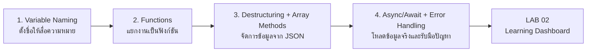
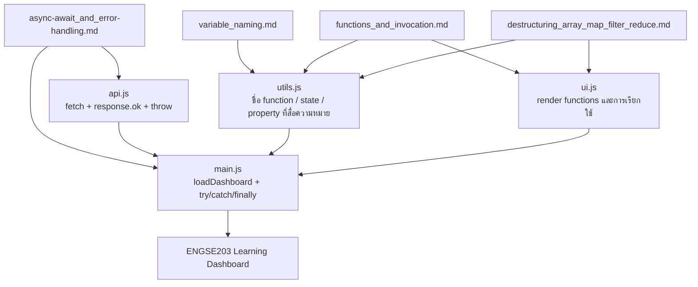

# LAB 02 — Modern JavaScript, Modules & Async Data

**สัปดาห์ที่ 2** · หน่วยที่ 1 พื้นฐานการพัฒนาโปรแกรมสมัยใหม่และการทำงานร่วมกัน  
**รูปแบบงาน:** รายบุคคล  
**CLO ที่เกี่ยวข้อง:** CLO1, CLO2  
**การประเมิน:** A2 Weekly LAB — **3.00 คะแนนย่อย**  
**รูปแบบการส่ง:** Student Repository เดิม + Pages Hub + LAB02 Result + merged PR `lab/week-02` + tag

> งานนี้ใช้ **Vanilla JavaScript + Vite** เพื่อฝึก JavaScript สมัยใหม่อย่างชัดเจนก่อนเริ่ม React.js ในสัปดาห์ที่ 3

---

## 0. เอกสารพื้นฐาน JavaScript ที่ใช้ตลอด LAB 02

LAB 02 ไม่ได้มุ่งเพียงให้หน้า Dashboard แสดงผลได้ แต่ให้ผู้เรียนฝึกเขียนโค้ดที่ **อ่านง่าย แยกหน้าที่ชัดเจน แก้ไขได้ และรับมือกับข้อมูลจริงได้** เอกสารในโฟลเดอร์ [`docs/`](./docs/) ทั้ง 4 เรื่องจึงเป็นพื้นฐานที่ต้องเชื่อมไปใช้กับโค้ดใน `src/` โดยตรง

> **ลำดับแนะนำ:** อ่านเรื่อง 1 → 2 → 3 → 4 แล้วกลับมาทำ Classroom Sandbox และ Starter Project

### 0.1 Learning Path: จากชื่อที่ดี → ฟังก์ชัน → ข้อมูล → เว็บที่รับมือข้อผิดพลาดได้



| ลำดับ | เอกสารพื้นฐาน | สิ่งที่ควรเข้าใจ | นำไปใช้ตรงไหนใน LAB 02 |
|---:|---|---|---|
| 1 | [**Variable Naming**](./docs/variable_naming.md) | `camelCase`, `PascalCase`, `SCREAMING_SNAKE_CASE`, การตั้งชื่อที่สื่อความหมาย | ตั้งชื่อ เช่น `learningTasks`, `selectedStatus`, `isLoading`, `fetchLearningTasks()` ในทุกไฟล์ `src/` |
| 2 | [**Functions and Invocation**](./docs/functions_and_invocation.md) | function declaration, arrow function, parameter, argument, `return`, pure function และ side effect | แยก `filterTasks()`, `getStats()`, `renderTasks()`, `loadDashboard()` ให้แต่ละฟังก์ชันมีหน้าที่ชัดเจน |
| 3 | [**Destructuring / Array Methods**](./docs/destructuring_array_map_filter_reduce.md) | object/array destructuring, spread, `map()`, `filter()`, `reduce()` และการไม่แก้ข้อมูลต้นฉบับโดยไม่จำเป็น | ใช้กับรายการ task: filter ตามคำค้น/สถานะ, map เพื่อ render card, reduce เพื่อสร้าง summary |
| 4 | [**Async/Await and Error Handling**](./docs/async-await_and_error-handling.md) | Promise, `fetch`, `async/await`, `response.ok`, `throw`, `try/catch/finally`, loading/success/error UI | พัฒนา `api.js` และ `loadDashboard()` เพื่อโหลด JSON จริงและทดสอบ `?simulateError=1` |

### 0.2 แผนที่การเชื่อมโยง Docs → Modules ของโครงงาน



### 0.3 วิธีใช้เอกสารระหว่างทำ LAB

1. **ก่อนเริ่มเขียน:** อ่านเรื่อง Variable Naming และ Functions เพื่อกำหนดชื่อและแบ่งหน้าที่ของโค้ดตั้งแต่ต้น
2. **เมื่อทำ `utils.js` และ `ui.js`:** เปิดเรื่อง Destructuring / `map()` / `filter()` / `reduce()` เพื่อจัดการ array ของ task โดยไม่แก้ข้อมูลต้นฉบับ
3. **เมื่อทำ `api.js` และ `main.js`:** เปิดเรื่อง Async/Await และ Error Handling เพื่อทำ `fetch`, ตรวจ `response.ok`, แสดง loading/success/error และใช้ `finally`
4. **เมื่อ review งานก่อนส่ง:** ตรวจว่า code ทุกส่วนสะท้อนหลักคิดจากทั้ง 4 เอกสาร ไม่ใช่เพียงทำให้ผลลัพธ์บนหน้าจอแสดงได้

> เอกสารทั้ง 4 เรื่องเป็น **คู่มืออ้างอิงระหว่างเขียนโค้ด** นักศึกษาควรเปิดอ่านพร้อม Starter Project และอธิบายได้ว่าตนเองใช้แนวคิดใดใน `api.js`, `utils.js`, `ui.js` และ `main.js`

---

## 0.4 Classroom Sandbox — ทำพร้อมผู้สอน

ก่อนเริ่มทำ LAB ให้นักศึกษาเปิด Sandbox เพื่อทดลองแนวคิดสำคัญในสัปดาห์นี้แบบแก้โค้ดและดูผลลัพธ์ได้ทันที

- [เปิด Modern JavaScript Classroom Sandbox](./sandbox/)
- GitHub Pages ของ Sandbox: `https://se-rmutl.github.io/engse203/labs/week-02-modern-javascript/sandbox/`
- เนื้อหา: `const/let`, template literal, destructuring, spread, `map/filter/reduce`, `async/await`, `response.ok`, `try/catch/finally`
- อ่านควบคู่กับ Docs: [Variable Naming](./docs/variable_naming.md) · [Functions](./docs/functions_and_invocation.md) · [Destructuring & Array Methods](./docs/destructuring_array_map_filter_reduce.md) · [Async/Await & Error Handling](./docs/async-await_and_error-handling.md)
- มีโจทย์ Try It เพิ่มหัวข้อละ 2 กิจกรรม พร้อมปุ่มเปิด starter code ใน Editor และเฉลย/ผลลัพธ์
- มี **Free JavaScript Editor** แบบว่าง พร้อมปุ่ม `Run code` / `Reset` และ Console output สำหรับ Live Coding ในชั้นเรียน

> ลำดับที่แนะนำ: ทำตัวอย่าง → กด Run code → ทำโจทย์ Try It → เปิดเฉลย → เริ่มพัฒนาไฟล์ใน `starter/src/`

---

## 1. เป้าหมายของ LAB

เมื่อทำ LAB 02 เสร็จ นักศึกษาจะสามารถ

1. จัดโครงสร้าง JavaScript ด้วย **ES Modules** และใช้ `import` / `export` ได้
2. ใช้ **ES6+** เช่น `const`, `let`, destructuring, spread syntax, arrow function และ array methods ในงานจริงได้
3. โหลดข้อมูล JSON ด้วย `fetch` และ `async/await` พร้อมตรวจ `response.ok`
4. จัดการสถานะ **loading / success / error** ด้วย `try/catch/finally` โดยหน้าเว็บไม่เป็น blank page เมื่อเกิดข้อผิดพลาด
5. ใช้ `npm` scripts สำหรับ development, check, build และ preview ได้
6. ใช้ Git workflow แบบ `lab/week-02 → meaningful commits → pull request → merge` ได้
7. นำ Vite build เข้า `publish/` และรวมไว้ใน **GitHub Pages Hub** ได้

---

## 2. โจทย์: ENGSE203 Learning Dashboard

ให้สร้างเว็บแอปพลิเคชันชื่อ **ENGSE203 Learning Dashboard** สำหรับแสดงรายการแผนการเรียนรู้/งานฝึกปฏิบัติของรายวิชา

### ฟีเจอร์ขั้นต่ำที่ต้องมี

- ส่วนหัวเว็บมีชื่อ `ENGSE203 Learning Dashboard` และคำอธิบายสั้น ๆ
- โหลดข้อมูลจาก `public/data/learning-tasks.json` **ด้วย `fetch` + `async/await`**
- ไม่สร้าง task card แบบ hard-code ทั้งหมดใน HTML
- แสดง summary card 4 รายการ: `Total`, `To do`, `In progress`, `Done`
- ค้นหารายการด้วยคำค้นจาก **ชื่อหรือหัวข้อ**
- กรองสถานะ: `All`, `To do`, `In progress`, `Done`
- แสดงสถานะ `กำลังโหลดข้อมูล...` ก่อนโหลดสำเร็จ
- แสดงข้อความสำเร็จเมื่อโหลดข้อมูลได้
- เมื่อเปิด URL ที่เติม `?simulateError=1` ต้องแสดง error message ที่อ่านเข้าใจได้ และไม่แสดงหน้า blank
- หน้าเว็บ responsive อย่างน้อยรองรับความกว้าง desktop และ mobile
- หลัง build ต้องมี `dist/` และนำเข้า Pages Hub ที่ `/labs/week-02/` ได้จริง

### โครงสร้างไฟล์ขั้นต่ำ

```text
labs/week-02/source/
├── public/
│   ├── .nojekyll
│   └── data/
│       └── learning-tasks.json
├── scripts/
│   └── check-project.mjs
├── src/
│   ├── api.js
│   ├── main.js
│   ├── style.css
│   ├── ui.js
│   └── utils.js
├── dist/                         # สร้างจาก npm run build; ไม่ commit ใน source
├── .gitignore
├── index.html
├── package.json
├── README.md
└── vite.config.js
```

### หน้าที่ของแต่ละ Module

| ไฟล์ | หน้าที่ |
|---|---|
| `src/api.js` | โหลดข้อมูล JSON, ตรวจ `response.ok`, แจ้ง error |
| `src/utils.js` | ตรรกะที่ไม่ผูกกับ DOM เช่น filter, summary, label |
| `src/ui.js` | สร้าง summary card, task card และข้อความสถานะ |
| `src/main.js` | เชื่อม module, เก็บ state, ผูก event และเรียกโหลดข้อมูล |

---

## 3. สิ่งที่ต้องเตรียม

- Node.js รุ่น LTS + npm
- Git และบัญชี GitHub ที่ตั้งค่า SSH แล้ว
- Visual Studio Code
- เบราว์เซอร์สมัยใหม่
- อินเทอร์เน็ต

### มาตรฐานการใช้เครื่อง

| เครื่องที่ใช้ | Environment ที่ต้องใช้ |
|---|---|
| **iMac M1 / macOS** | VS Code Integrated Terminal (zsh) และโฟลเดอร์ `~/Documents/ENGSE203` |
| **Windows 11 notebook** | **VS Code Remote - WSL** + Ubuntu 24.04 LTS, ใช้โฟลเดอร์ `~/workspace/engse203` ใน WSL |

> สำหรับ Windows ห้ามรัน Node.js/npm/Git ของ LAB นี้จาก PowerShell หรือจาก `/mnt/c/...` ให้เปิดโฟลเดอร์ผ่าน WSL และตรวจว่ามุมซ้ายล่างของ VS Code แสดง `WSL: Ubuntu-24.04`

อ่านคู่มือเพิ่มเติม:
- [Windows 11 + WSL2 Setup](../../docs/setup/windows-11-wsl2.md)
- [GitHub SSH + VS Code Setup](../../docs/setup/README.md)
- [คู่มือการส่งงาน](../../docs/submission-guide.md)

---

## 4. ขั้นตอนการทำ LAB

### ขั้นตอนที่ 1 — เปิด Weekly Branch ใน Student Repository

เปิด Terminal ที่ root ของ `engse203-student-labs-<student-id>`:

```bash
git switch main
git pull origin main
git switch -c lab/week-02
```

ตรวจสอบ branch:

```bash
git branch --show-current
```

ผลลัพธ์ต้องเป็น `lab/week-02`

---

### ขั้นตอนที่ 2 — นำ Starter Files ไปใช้

ใน Course Repository นี้มี starter files อยู่ที่ [`starter/`](./starter/)

ให้คัดลอก **เนื้อหาภายใน** โฟลเดอร์ `starter/` ไปที่ `labs/week-02/source/` โดยไม่คัดลอก `.git` ของ Course Repository

ตัวอย่างเมื่อ clone Course Repository ไว้ข้าง ๆ งานของตนเอง:

```bash
cp -R ../engse203-lab/labs/week-02-modern-javascript/starter/. labs/week-02/source/
```

หรือใช้การคัดลอกไฟล์ผ่าน Finder / File Explorer ได้ แต่ต้องคงโครงสร้างโฟลเดอร์ตามโจทย์

จากนั้นติดตั้ง dependency:

```bash
npm --prefix labs/week-02/source install
```

> Starter files มี `TODO` เพื่อเป็นจุดที่นักศึกษาต้องพัฒนาเอง ห้ามนำ solution ของผู้อื่นมาแทนที่ starter โดยไม่ทำความเข้าใจ

---

### ขั้นตอนที่ 3 — ตั้งค่า Vite สำหรับ Pages Hub

Starter กำหนด `base: './'` และ build output `dist/` แล้ว จึงไม่ต้องใส่ชื่อ repository ลงใน `vite.config.js` และสามารถนำ build ไปวางใต้ `/labs/week-02/` ได้

ก่อนเริ่มพัฒนาให้เข้า source folder:

```bash
cd labs/week-02/source
```

---

### ขั้นตอนที่ 4 — พัฒนา Modern JavaScript Modules

พัฒนาไฟล์ต่อไปนี้ให้ครบ

#### 4.1 `src/api.js`

อ่านประกอบก่อนเริ่ม: [Async/Await และ Error Handling](./docs/async-await_and_error-handling.md) — โดยเฉพาะ `fetch`, `response.ok`, `throw new Error(...)`, `async/await` และ `try/catch/finally`

ต้องมี

- `export async function fetchLearningTasks(...)`
- `fetch` ไปยัง `data/learning-tasks.json` โดยคำนึงถึง Vite base path
- ตรวจ `response.ok`
- `throw new Error(...)` เมื่อโหลดข้อมูลไม่สำเร็จ
- รองรับ `simulateError` เพื่อให้ทดสอบ URL `?simulateError=1`

#### 4.2 `src/utils.js`

อ่านประกอบก่อนเริ่ม: [Variable Naming](./docs/variable_naming.md) · [Functions and Invocation](./docs/functions_and_invocation.md) · [Destructuring / Array Methods](./docs/destructuring_array_map_filter_reduce.md)

ต้องมีฟังก์ชันสำหรับ

- แปลงชื่อสถานะเป็นข้อความ
- ค้นหาและกรอง task จาก `query` และ `status`
- คำนวณ summary ได้แก่ total, todo, doing, done
- ใช้ Modern JavaScript อย่างน้อย 2 แนวคิด เช่น destructuring, spread syntax, arrow function, optional chaining, `map`, `filter`, `reduce`

#### 4.3 `src/ui.js`

อ่านประกอบก่อนเริ่ม: [Functions and Invocation](./docs/functions_and_invocation.md) และ [Destructuring / Array Methods](./docs/destructuring_array_map_filter_reduce.md) เพื่อสร้าง render function ที่รับข้อมูลเข้าอย่างชัดเจน

ต้องมีฟังก์ชันสำหรับ

- แสดงข้อความ loading / success / error
- สร้าง summary cards
- สร้าง task cards จากข้อมูลที่โหลดมา
- แสดง empty state เมื่อค้นหา/กรองแล้วไม่พบข้อมูล

#### 4.4 `src/main.js`

อ่านประกอบก่อนเริ่ม: [Functions and Invocation](./docs/functions_and_invocation.md) และ [Async/Await และ Error Handling](./docs/async-await_and_error-handling.md) เพื่อเชื่อม event, state, render และลำดับ async อย่างเป็นระบบ

ต้องมี

- import module จาก `api.js`, `utils.js`, `ui.js`
- state สำหรับ tasks, query และ status
- event listener ของ search input และ status select
- `async function loadDashboard()`
- `try/catch/finally` ที่แสดงผล error state อย่างชัดเจน
- อ่าน `simulateError` จาก URL query string

---

### ขั้นตอนที่ 5 — ตรวจและรันในเครื่อง

คำสั่งที่ต้องใช้:

```bash
npm run check
npm run dev
```

เปิด URL ที่ Vite แสดงใน Terminal แล้วตรวจฟีเจอร์ต่อไปนี้

1. หน้าเว็บโหลดรายการ task และ summary cards
2. ค้นหาคำว่า เช่น `React` หรือ `API`
3. เลือก filter status แล้วรายการเปลี่ยนตาม
4. เปิด URL แบบ error state

```text
http://localhost:5173/?simulateError=1
```

> URL ของ dev server อาจใช้ port อื่นได้ ให้คงเฉพาะ path และ query string ตามตัวอย่าง

ทดสอบ build:

```bash
npm run build
npm run preview
```

หลัง `npm run build` ต้องมี `labs/week-02/source/dist/` จากนั้นกลับไป root และนำเข้า publish:

```bash
cd ../../..
npm run import:publish -- week-02 labs/week-02/source/dist
npm run build:pages
npm run verify:lab -- week-02
```

---

### ขั้นตอนที่ 6 — Commit, Pull Request และ Merge

ขั้นต่ำแนะนำให้มีอย่างน้อย **3 meaningful commits** บน feature branch เช่น

```bash
git add .
git commit -m "chore: scaffold LAB 02 dashboard"

git add .
git commit -m "feat: load and filter learning tasks"

git add .
git commit -m "feat: add dashboard UI and error state"
```

สร้าง build output ก่อนเปิด Pull Request:

```bash
npm run check
npm run build
git add .
git commit -m "build: prepare GitHub Pages deployment"
git push -u origin lab/week-02
```

บน GitHub:

1. เลือก **Compare & pull request**
2. สร้าง Pull Request จาก `lab/week-02` ไป `main`
3. ใน PR description ให้ตอบสั้น ๆ:
   - ใช้ ES Modules อย่างไร
   - ทดสอบ normal และ error state อย่างไร
   - วิธี run/build ของโครงงานคืออะไร
4. ตรวจสอบไฟล์และ merge Pull Request ไป `main`

ก่อน merge ให้ใส่ PR URL ใน `labs/week-02/lab-metadata.json`, เปลี่ยน status เป็น `submitted`, รัน build/verify และ push metadata ล่าสุด

---

### ขั้นตอนที่ 7 — ตรวจ GitHub Pages Hub

Pages ตั้งครั้งเดียวก่อน LAB01 เป็น `main /docs` หลัง merge ให้เปิด:

```text
https://<github-username>.github.io/engse203-student-labs-<student-id>/labs/week-02/
```

ตรวจทั้ง normal state และ error state:

```text
https://<github-username>.github.io/engse203-student-labs-<student-id>/labs/week-02/?simulateError=1
```

> GitHub Pages ที่ publish แล้วเข้าถึงได้สาธารณะ จึงห้ามใส่ password, token, ข้อมูลส่วนบุคคลที่ไม่จำเป็น หรือข้อมูลลับใด ๆ ใน repository และในหน้าเว็บ

---

## 5. สิ่งที่ต้องส่ง

ส่งผ่าน LMS/Google Classroom หรือระบบที่ผู้สอนกำหนด

1. Pages Hub URL และ LAB02 result URL
2. URL Pull Request จาก `lab/week-02` ไป `main` ที่ merge แล้ว
3. Tag `lab-02-submission-v1`
4. `README.md` ที่มีหัวข้อขั้นต่ำ:
   - ชื่อรายวิชา / รหัสนักศึกษา (ตามนโยบายรายวิชา)
   - คำอธิบายโครงงาน
   - วิธีติดตั้งและรัน `npm install`, `npm run dev`, `npm run check`, `npm run build`
   - GitHub Pages URL
   - ภาพหน้าจอ **normal state** และ **error state**
   - ปัญหาที่พบและวิธีแก้
   - `References & AI Assistance`
5. Source code ที่ `labs/week-02/source/` และ publish output ที่ `labs/week-02/publish/`

> **ไม่ส่งไฟล์ ZIP** เว้นแต่ผู้สอนกำหนดเป็นกรณีพิเศษ

---

## 6. เกณฑ์ประเมิน A2: LAB 02 (รวม 3.00 คะแนน)

| เกณฑ์ | หลักฐานที่ตรวจ | คะแนน |
|---|---|---:|
| Modern JavaScript & ES Modules | Modern JS เหมาะสม, แยก `api/utils/ui/main`, import/export ถูกต้อง | 0.80 |
| Async/Await & Error Handling | `fetch`, `async/await`, `response.ok`, `try/catch/finally`, loading/success/error state | 0.80 |
| npm Scripts & Build | `dev`, `build`, `preview`, `check`; build เข้า `publish/` และ Pages Hub ได้ | 0.40 |
| Git Workflow | feature branch, meaningful commits, PR และ merge ตรวจสอบได้ | 0.50 |
| GitHub Pages & Documentation | Pages ทำงาน, README ครบ, หลักฐาน normal/error, อ้างอิง/AI disclosure | 0.50 |
| **รวม** |  | **3.00** |

---

## 7. Checklist ก่อนส่ง

### 7.1 ตรวจการใช้ JavaScript Foundations

- [ ] ใช้ชื่อ variable/function แบบ `camelCase` และสื่อความหมายตาม [Variable Naming](./docs/variable_naming.md)
- [ ] แยก function ให้มีหน้าที่ชัดเจน รับ parameter/คืนค่าอย่างเหมาะสมตาม [Functions and Invocation](./docs/functions_and_invocation.md)
- [ ] ใช้ destructuring, `map()`, `filter()` หรือ `reduce()` ในจุดที่เหมาะสมตาม [Destructuring / Array Methods](./docs/destructuring_array_map_filter_reduce.md)
- [ ] ใช้ `fetch`, `response.ok`, `try/catch/finally` และแสดง UI state ตาม [Async/Await and Error Handling](./docs/async-await_and_error-handling.md)

### 7.2 Checklist งานและการส่ง

- [ ] ใช้ `engse203-student-labs-<student-id>` repository เดิม
- [ ] ทำงานบน `lab/week-02` และ merge PR ไป `main` แล้ว
- [ ] มี `src/api.js`, `src/utils.js`, `src/ui.js`, `src/main.js`
- [ ] ข้อมูลโหลดจาก JSON ด้วย `fetch` และ `async/await`
- [ ] มี `response.ok`, `try/catch/finally` และ error state จาก `?simulateError=1`
- [ ] ค้นหา กรอง และ summary ทำงาน
- [ ] `npm run check` ผ่าน
- [ ] `npm run build` ผ่าน, import เข้า `publish/` และ `npm run build:pages` ผ่าน
- [ ] Pages Hub และ `/labs/week-02/` เปิดได้
- [ ] README มีวิธีรัน, screenshot normal/error และ References & AI Assistance
- [ ] ไม่มี `node_modules`, token, password หรือ `.env` ที่มีความลับใน repository
- [ ] ส่ง Pages Hub URL + LAB02 Result URL + merged PR URL + tag ผ่านระบบที่ผู้สอนกำหนดแล้ว

---

## 8. ปัญหาที่พบบ่อย

| อาการ | แนวทางตรวจสอบ |
|---|---|
| `npm` หรือ `node` ไม่พบคำสั่ง | Windows ให้ตรวจว่ากำลังใช้ terminal ของ WSL Ubuntu; ปิด/เปิด terminal ใหม่หลังติดตั้ง |
| เปิด `index.html` ตรง ๆ แล้วข้อมูลไม่โหลด | ต้องใช้ `npm run dev` หรือ `npm run preview` ไม่ใช้ `file://` |
| Deploy แล้ว CSS/JS/JSON ขึ้น 404 | ตรวจ `base: './'`, build ใหม่, import `dist/` เข้า publish และรัน `npm run build:pages` |
| Browser แจ้ง import error | ตรวจ `<script type="module">` และใช้ relative import เช่น `./utils.js` |
| GitHub Pages ยังไม่ขึ้น | ตรวจ `Settings → Pages → main /docs`, merge ล่าสุด และดู Pages deployment |
| `git push` ผ่าน SSH ไม่ได้ | ทดสอบ `ssh -T git@github.com` และกลับไปตรวจ SSH key ตาม [GitHub SSH Guide](../../docs/setup/git-github-ssh.md) |

---

## 9. ความซื่อสัตย์ทางวิชาการ

งานนี้เป็น **งานรายบุคคล** นักศึกษาปรึกษาแนวคิดได้ แต่ต้องพัฒนา repository ของตนเองและสามารถอธิบายโค้ดทุกส่วนที่ส่งได้

- ให้เปิดเผยเว็บไซต์ เอกสาร ตัวอย่างโค้ด และการใช้ AI ในหัวข้อ `References & AI Assistance`
- ระบุสิ่งที่ตนเองนำมาปรับและสิ่งที่เข้าใจจากแหล่งดังกล่าว
- ห้ามคัดลอก repository ของผู้อื่นหรือ upload solution ของผู้อื่นเป็นงานของตน
- ห้าม push token, password, `.env` หรือข้อมูลลับขึ้น GitHub

---

## เอกสารอ้างอิง

### เอกสารพื้นฐานของ LAB 02

- [Variable Naming: Case และ Best Practices](./docs/variable_naming.md)
- [JavaScript Functions และรูปแบบการเรียกใช้](./docs/functions_and_invocation.md)
- [Destructuring และ Array Methods: `map()` / `filter()` / `reduce()`](./docs/destructuring_array_map_filter_reduce.md)
- [Async/Await และ Error Handling สำหรับเว็บที่โหลดข้อมูลจริง](./docs/async-await_and_error-handling.md)

### แหล่งอ้างอิงเพิ่มเติม

- GitHub Docs — Quickstart for GitHub Pages
- GitHub Docs — Configuring a publishing source for your GitHub Pages site
- Vite Documentation — Static Site Deployment
- MDN Web Docs — JavaScript Modules, Fetch API, async function และ Error handling
