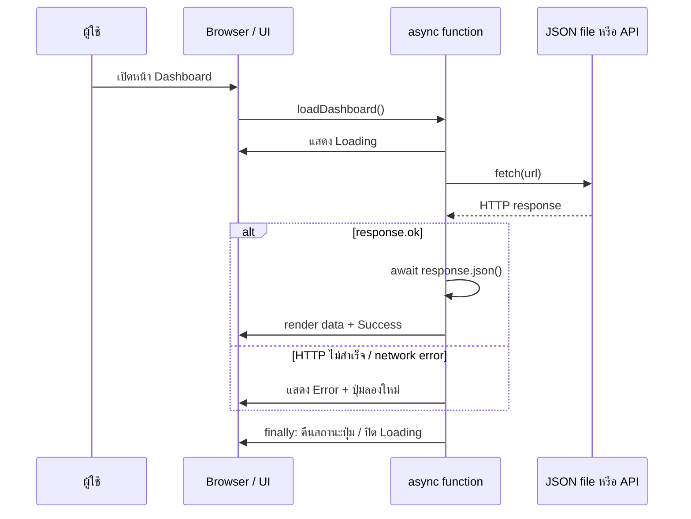
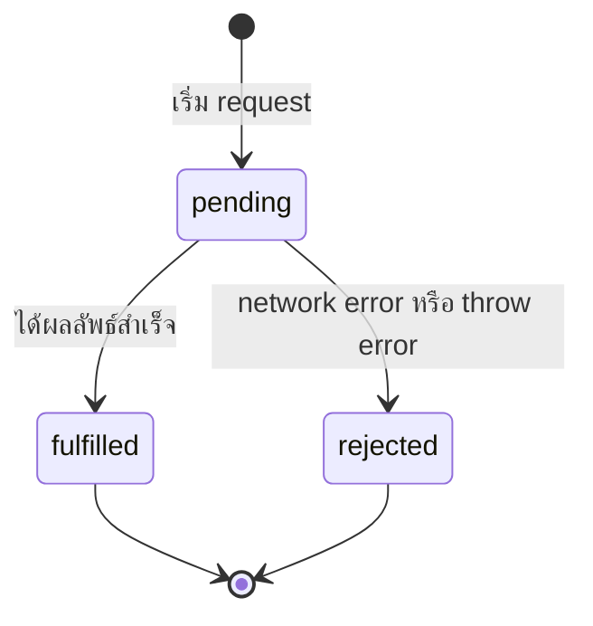
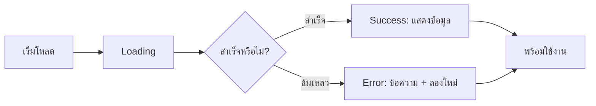

# Async/Await และ Error Handling พื้นฐาน JavaScript สำหรับเว็บที่โหลดข้อมูลจริง

> เอกสารประกอบการสอนรายวิชา **ENGSE203 การเขียนโปรแกรมสำหรับวิศวกรซอฟต์แวร์**  
> หัวข้อ: `async/await`, `fetch`, `response.ok`, `try/catch/finally`, UI state และการทดสอบกรณีผิดพลาด


---

## 1) เป้าหมายการเรียนรู้

หลังเรียนจบ ผู้เรียนควรสามารถ:

1. อธิบายได้ว่าทำไมการโหลดข้อมูลจากไฟล์ JSON หรือ API จึงเป็นงานแบบ asynchronous
2. ใช้ `async` และ `await` เพื่อเขียนโค้ดรอผลลัพธ์อย่างอ่านง่าย
3. ใช้ `fetch()` โหลดข้อมูลจริงผ่าน local development server หรือ API
4. ตรวจ `response.ok` ก่อนแปลงข้อมูล JSON
5. จัดการสถานะ **loading / success / error** ด้วย `try/catch/finally`
6. ออกแบบข้อความ error ที่ผู้ใช้เข้าใจได้ และเก็บรายละเอียดเชิงเทคนิคไว้ใน Console

---

## 2) ภาพรวม: เว็บไม่ได้ “หยุดรอ” ข้อมูล

เมื่อผู้ใช้เปิดหน้า Dashboard เบราว์เซอร์ต้องขอข้อมูลจากแหล่งข้อมูล เช่น

- `public/data/learning-tasks.json` ที่ Vite ให้บริการผ่าน local server
- REST API ของ Back-end เช่น `GET /api/tasks`
- API ภายนอกที่ได้รับอนุญาตให้เรียกใช้

การส่ง request และรอ response อาจใช้เวลา หรืออาจล้มเหลวได้ จึงไม่ควรเขียน UI แบบที่หน้าจอว่างหรือแสดงข้อมูลเก่าโดยไม่อธิบาย



### คำสำคัญ

| คำ | ความหมายแบบสั้น |
|---|---|
| **Synchronous** | ทำทีละคำสั่ง งานก่อนต้องเสร็จก่อนจึงไปงานถัดไป |
| **Asynchronous** | เริ่มงานที่ต้องรอได้ แล้ว JavaScript ไปทำงานอื่นต่อ เมื่อผลลัพธ์พร้อมจึงกลับมาดำเนินการ |
| **Promise** | ตัวแทนของผลลัพธ์ที่ยังมาไม่ถึงในขณะนี้ |
| **async function** | ฟังก์ชันที่คืนค่าเป็น Promise เสมอ |
| **await** | รอผลลัพธ์ของ Promise ภายใน `async function` โดยไม่ block หน้าเว็บ |
| **fetch** | API ของเบราว์เซอร์สำหรับส่ง HTTP request |

---

## 3) เข้าใจ Promise ก่อนใช้ async/await

`fetch()` ไม่ได้คืน JSON ทันที แต่คืน **Promise** ที่บอกว่า “ผลลัพธ์จะมาในอนาคต”

```js
const promise = fetch("/data/learning-tasks.json");
console.log(promise); // Promise { <pending> }
```

Promise มี 3 สถานะหลัก:



แบบเดิมอาจเขียนด้วย `.then()` และ `.catch()`:

```js
fetch("/data/learning-tasks.json")
  .then((response) => response.json())
  .then((tasks) => console.log(tasks))
  .catch((error) => console.error(error));
```

แต่ในรายวิชานี้จะใช้ `async/await` เพราะลำดับขั้นอ่านคล้ายโค้ดปกติ และจัดการ error ด้วย `try/catch/finally` ได้ชัดเจนกว่า

---

## 4) `async` และ `await` ใช้อย่างไร

### 4.1 `async` ทำให้ฟังก์ชันคืน Promise

```js
async function getCourseName() {
  return "ENGSE203";
}

const result = getCourseName();
console.log(result); // Promise { "ENGSE203" }
```

### 4.2 `await` รอ Promise ภายใน `async function`

```js
function wait(milliseconds) {
  return new Promise((resolve) => {
    setTimeout(resolve, milliseconds);
  });
}

async function demonstrateAwait() {
  console.log("1. เริ่มขอข้อมูล");
  await wait(1000);
  console.log("2. ได้ข้อมูลแล้ว");
}

demonstrateAwait();
console.log("3. UI ยังตอบสนองได้ระหว่างรอ");
```

ผลลัพธ์โดยแนวคิด:

```text
1. เริ่มขอข้อมูล
3. UI ยังตอบสนองได้ระหว่างรอ
(ประมาณ 1 วินาที)
2. ได้ข้อมูลแล้ว
```

> `await` ไม่ได้ “หยุดทั้งเบราว์เซอร์” แต่หยุดเฉพาะการทำงานต่อจากบรรทัดนั้นภายใน async function จน Promise เสร็จ

---

## 5) โหลดข้อมูลจริงด้วย `fetch()`

ใน LAB 2 ให้เก็บ JSON ไว้ที่:

```text
public/data/learning-tasks.json
```

ตัวอย่างข้อมูล:

```json
[
  {
    "id": 1,
    "title": "Modern JavaScript: ES6+",
    "topic": "JavaScript",
    "status": "todo",
    "minutes": 45
  },
  {
    "id": 2,
    "title": "ES Modules and import/export",
    "topic": "Architecture",
    "status": "doing",
    "minutes": 60
  }
]
```

### 5.1 ฟังก์ชันโหลดข้อมูลแบบพื้นฐาน

```js
async function fetchLearningTasks() {
  const response = await fetch("/data/learning-tasks.json");
  return response.json();
}
```

โค้ดนี้พอเริ่มต้นได้ แต่ยังมีปัญหา: ถ้า URL ผิดและ server ตอบ `404` ฟังก์ชัน `fetch()` อาจยัง resolve response มาให้ ไม่ได้ throw error โดยอัตโนมัติ

---

## 6) เหตุผลที่ต้องตรวจ `response.ok`

`fetch()` จะ reject ในกรณี network problem เช่น offline, DNS ล้มเหลว หรือ request ถูกยกเลิก แต่ HTTP error เช่น `404 Not Found` และ `500 Internal Server Error` มักยังได้ `Response` กลับมา

ดังนั้นต้องตรวจด้วยตนเอง:

```js
const response = await fetch(url);

if (!response.ok) {
  throw new Error(`Unable to load tasks (HTTP ${response.status})`);
}

const tasks = await response.json();
```

### ตารางสรุปพฤติกรรมที่ควรจำ

| เหตุการณ์ | `fetch()` throw/reject เลยหรือไม่ | สิ่งที่โค้ดควรทำ |
|---|---:|---|
| ไม่มีอินเทอร์เน็ต / server ติดต่อไม่ได้ | โดยทั่วไปใช่ | จับด้วย `catch` |
| URL ผิด, server ส่ง 404 | ไม่จำเป็นต้อง reject | ตรวจ `response.ok` แล้ว `throw` เอง |
| Server ส่ง 500 | ไม่จำเป็นต้อง reject | ตรวจ `response.ok` แล้ว `throw` เอง |
| JSON รูปแบบไม่ถูกต้อง | reject ตอน `response.json()` | จับด้วย `catch` |
| ข้อมูล JSON ไม่ตรง schema ที่คาด | ไม่จำเป็นต้อง throw | validate ข้อมูล แล้ว throw ข้อผิดพลาดที่ชัดเจน |

---

## 7) รูปแบบมาตรฐาน: `try / catch / finally`

โครงสร้างหลักที่ใช้ในหน้าเว็บ:

```js
async function loadDashboard() {
  try {
    // 1) สื่อสารว่าเริ่มทำงาน
    setMessage("loading", "กำลังโหลดข้อมูล...");

    // 2) รอข้อมูลจริง
    const tasks = await fetchLearningTasks();

    // 3) นำข้อมูลไปแสดง
    renderDashboard(tasks);
    setMessage("success", `โหลดข้อมูล ${tasks.length} รายการแล้ว`);
  } catch (error) {
    // 4) จัดการข้อผิดพลาดอย่างปลอดภัย
    console.error(error);
    clearDashboard();
    setMessage("error", `ไม่สามารถโหลดข้อมูลได้: ${error.message}`);
  } finally {
    // 5) งานเก็บกวาดที่ต้องทำเสมอ
    setLoadingButton(false);
  }
}
```

### หน้าที่ของแต่ละส่วน

| ส่วน | ควรทำอะไร | ตัวอย่าง |
|---|---|---|
| `try` | งานปกติที่อาจล้มเหลว | fetch, parse JSON, validate, render |
| `catch` | ทำให้ผู้ใช้ยังเข้าใจว่าระบบเกิดอะไรขึ้น | แจ้ง error, ซ่อนข้อมูลเก่า, เปิดปุ่มลองใหม่ |
| `finally` | คืน UI ไปสู่สถานะใช้งานได้เสมอ | ปิด spinner, enable ปุ่ม, บันทึกเวลา |

> ไม่ควรใช้ `finally` เพื่อแสดง success เพราะมันทำงานทั้งตอนสำเร็จและตอนล้มเหลว

---

## 8) ตัวอย่างใช้งานจริงในโครงสร้าง ES Modules

### 8.1 `src/api.js` — รับผิดชอบการโหลดข้อมูล

```js
export async function fetchLearningTasks({ simulateError = false, signal } = {}) {
  if (simulateError) {
    throw new Error("Simulated error: data source is unavailable");
  }

  // ใช้ BASE_URL เพื่อให้ path ทำงานทั้งใน Vite dev server และ GitHub Pages
  const url = `${import.meta.env.BASE_URL}data/learning-tasks.json`;
  const response = await fetch(url, { signal });

  if (!response.ok) {
    throw new Error(`Unable to load tasks (HTTP ${response.status})`);
  }

  const tasks = await response.json();

  if (!Array.isArray(tasks)) {
    throw new Error("Invalid data format: expected an array of tasks");
  }

  return tasks;
}
```

### 8.2 `src/ui.js` — รับผิดชอบข้อความสถานะ

```js
export function setMessage(element, type, text) {
  element.className = `message message--${type}`;
  element.textContent = text;
}

export function setLoading(button, isLoading) {
  button.disabled = isLoading;
  button.textContent = isLoading ? "กำลังโหลด..." : "โหลดข้อมูลใหม่";
}
```

### 8.3 `src/main.js` — เชื่อม state, API และ UI

```js
import { fetchLearningTasks } from "./api.js";
import { setLoading, setMessage } from "./ui.js";

const elements = {
  message: document.querySelector("#app-message"),
  reload: document.querySelector("#reload-button"),
  taskList: document.querySelector("#task-list"),
};

function renderTasks(tasks) {
  elements.taskList.innerHTML = tasks
    .map(({ title, topic, status }) => `
      <article class="task-card">
        <span>${topic}</span>
        <h2>${title}</h2>
        <p>${status}</p>
      </article>
    `)
    .join("");
}

async function loadDashboard() {
  try {
    setLoading(elements.reload, true);
    setMessage(elements.message, "loading", "กำลังโหลดข้อมูล...");

    const params = new URLSearchParams(window.location.search);
    const tasks = await fetchLearningTasks({
      simulateError: params.get("simulateError") === "1",
    });

    renderTasks(tasks);
    setMessage(elements.message, "success", `โหลดข้อมูล ${tasks.length} รายการแล้ว`);
  } catch (error) {
    console.error("Dashboard loading failed:", error);
    elements.taskList.innerHTML = "";
    setMessage(
      elements.message,
      "error",
      "ไม่สามารถโหลดข้อมูลได้ กรุณาตรวจสอบการเชื่อมต่อหรือกดลองใหม่",
    );
  } finally {
    setLoading(elements.reload, false);
  }
}

elements.reload.addEventListener("click", loadDashboard);
loadDashboard();
```

---

## 9) ออกแบบ UI state ให้ผู้ใช้เข้าใจ

เมื่อเว็บโหลดข้อมูลจริง ผู้ใช้ควรเห็นสถานะไม่เกิน 4 แบบหลัก:



| State | สิ่งที่แสดง | สิ่งที่ไม่ควรทำ |
|---|---|---|
| Loading | Spinner หรือข้อความ “กำลังโหลดข้อมูล...” | ปล่อยหน้าจอขาวโดยไม่มีคำอธิบาย |
| Success | ข้อมูลจริง + สรุปจำนวน | แสดง success ทั้งที่ข้อมูลไม่ได้ถูก render |
| Empty | “ไม่พบข้อมูล” เมื่อ request สำเร็จแต่รายการว่าง | สับสนระหว่าง empty กับ error |
| Error | ข้อความชัดเจน + ปุ่มลองใหม่ | แสดง error technical ยาว ๆ ทั้งหมดแก่ผู้ใช้ |

ตัวอย่างข้อความที่เหมาะสม:

```text
กำลังโหลดแผนการเรียนรู้...
โหลดข้อมูล 4 รายการแล้ว
ไม่พบรายการที่ตรงกับเงื่อนไข
ไม่สามารถโหลดข้อมูลได้ กรุณาลองใหม่อีกครั้ง
```

---

## 10) การทดสอบ error โดยไม่ต้องทำให้ระบบพังจริง

LAB 2 ใช้ query string เพื่อจำลอง error:

```text
http://localhost:5173/?simulateError=1
```

ใน `api.js`:

```js
if (simulateError) {
  throw new Error("Simulated error: data source is unavailable");
}
```

### กรณีทดสอบที่ควรทำ

| กรณี | วิธีทดสอบ | ผลลัพธ์ที่ควรเห็น |
|---|---|---|
| Normal state | เปิด URL ปกติ | แสดงรายการและ success message |
| Simulated error | เติม `?simulateError=1` | Error message และไม่มี task เก่าค้าง |
| HTTP 404 | เปลี่ยน path ให้ผิดชั่วคราว | `response.ok` เป็น false และเข้า `catch` |
| JSON invalid | แก้ JSON ให้ syntax ผิดชั่วคราว | เข้า `catch` ตอน parse JSON |
| Empty data | ใช้ `[]` | Empty state ไม่ใช่ Error state |

---

## 11) การยกเลิก request ด้วย `AbortController` (พื้นฐานเพิ่มเติม)

ใช้เมื่อผู้ใช้กดโหลดใหม่หลายครั้ง หรือเปลี่ยนหน้าในขณะที่ request เดิมยังไม่เสร็จ

```js
let activeController;

async function loadDashboard() {
  activeController?.abort();
  activeController = new AbortController();

  try {
    const tasks = await fetchLearningTasks({
      signal: activeController.signal,
    });
    renderTasks(tasks);
  } catch (error) {
    if (error.name === "AbortError") {
      return; // ไม่ใช่ error ที่ต้องรบกวนผู้ใช้
    }
    showError("ไม่สามารถโหลดข้อมูลได้");
  }
}
```

> สำหรับ LAB 2 ไม่จำเป็นต้องใส่ `AbortController` เป็นข้อกำหนดขั้นต่ำ แต่เป็นแนวคิดที่ดีเมื่อทำงานกับ search, auto-complete หรือหน้าเว็บที่มีการเปลี่ยนข้อมูลบ่อย

---

## 12) ความสัมพันธ์กับ Vite และ GitHub Pages

### ทำไมไม่ควรเปิด `index.html` ด้วยการดับเบิลคลิก

เมื่อเปิดผ่าน `file://` เบราว์เซอร์อาจจำกัดการทำงานของ ES Modules และ `fetch()` เพื่อความปลอดภัย ทำให้พฤติกรรมไม่เหมือนเว็บจริง

ให้ใช้ Vite:

```bash
npm run dev
```

แล้วเปิด URL ที่ terminal แสดง เช่น:

```text
http://localhost:5173/
```

### ทำไมใช้ `import.meta.env.BASE_URL`

GitHub Pages มัก deploy เว็บไว้ใต้ชื่อ repository เช่น:

```text
https://<username>.github.io/engse203-lab02-<student-id>/
```

หากเขียน path แบบ `/data/learning-tasks.json` อาจชี้ไปยัง root ของ domain แทนที่จะเป็น root ของ project

```js
const url = `${import.meta.env.BASE_URL}data/learning-tasks.json`;
```

Vite จะช่วยให้ path นี้สอดคล้องกับ `base` ที่กำหนดใน `vite.config.js` เมื่อ build เพื่อ deploy

---

## 13) ข้อผิดพลาดที่พบบ่อย และวิธีคิดแก้ปัญหา

| อาการ | สาเหตุที่เป็นไปได้ | วิธีตรวจ |
|---|---|---|
| หน้าเว็บว่าง | ไม่มี loading/error UI หรือ JavaScript error | เปิด DevTools → Console |
| JSON ไม่โหลด | path ผิด, เปิดผ่าน `file://`, base path ไม่ตรง | Network tab + ตรวจ URL |
| 404 แต่เข้า success | ไม่ตรวจ `response.ok` | เพิ่ม `if (!response.ok) throw ...` |
| `Unexpected token` ตอน parse | JSON syntax ไม่ถูกต้อง | ตรวจ JSON ด้วย formatter/validator |
| กดโหลดหลายครั้ง UI แปลก | request เก่าตอบกลับช้ากว่า request ใหม่ | พิจารณา `AbortController` |
| GitHub Pages asset หาย | `vite.config.js` base ไม่ตรงชื่อ repo | ตรวจ `base: "/repo-name/"` |

### ลำดับ debug ที่แนะนำ

1. อ่านข้อความ error ใน **Console** ก่อน
2. เปิด **Network** และดู request ของ JSON/API ว่า status เป็นเท่าใด
3. ตรวจ URL จริงที่ `fetch()` เรียก
4. ตรวจ `response.ok` และตรวจว่า code เข้า `catch` หรือไม่
5. แยกว่าปัญหาเป็น **network**, **HTTP**, **JSON parse**, หรือ **UI render**

---

## 14) Checklist สำหรับโค้ดโหลดข้อมูลที่ดี

- [ ] ใช้ `async function` สำหรับลำดับงานที่ต้องรอ
- [ ] แสดง loading state ก่อน `await fetch()`
- [ ] ตรวจ `response.ok` ทุกครั้งที่ใช้ HTTP fetch
- [ ] ใช้ `await response.json()` หลังตรวจ response สำเร็จ
- [ ] มี `try/catch` ครอบการโหลดและการ parse ข้อมูล
- [ ] `catch` แสดงข้อความที่ผู้ใช้เข้าใจได้
- [ ] log รายละเอียด error ใน Console เพื่อ debug
- [ ] `finally` คืนสถานะ UI เช่น เปิดปุ่มใหม่หรือปิด spinner
- [ ] แยกหน้าที่เป็น `api.js`, `ui.js`, `main.js`
- [ ] ทดสอบทั้ง normal, error, empty และ deployed state

---

## 15) แบบฝึกหัดสั้น

### Exercise 1 — เพิ่ม Empty State
เมื่อข้อมูลเป็น `[]` ให้แสดง:

```text
ยังไม่มีแผนการเรียนรู้ในขณะนี้
```

โดยไม่แสดงเป็น error

### Exercise 2 — เพิ่มปุ่ม Retry
เพิ่มปุ่ม `โหลดข้อมูลใหม่` ที่เรียก `loadDashboard()` ซ้ำ และปิดปุ่มชั่วคราวระหว่าง loading

### Exercise 3 — ทำ Error Message ให้ปลอดภัย
- ผู้ใช้เห็น: `ไม่สามารถโหลดข้อมูลได้ กรุณาลองใหม่`
- Console เห็นรายละเอียด: HTTP status, stack trace หรือ URL ที่ผิด

### Exercise 4 — แยกชนิด error
สร้างฟังก์ชันแปลง error เป็นข้อความสำหรับผู้ใช้:

```js
function getUserFriendlyError(error) {
  if (error.name === "AbortError") return "ยกเลิกการโหลดข้อมูลแล้ว";
  if (error.message.includes("HTTP 404")) return "ไม่พบแหล่งข้อมูลที่ต้องการ";
  if (error.message.includes("HTTP 500")) return "ระบบต้นทางมีปัญหาชั่วคราว";
  return "ไม่สามารถโหลดข้อมูลได้ กรุณาลองใหม่";
}
```

---

## 16) สรุปสำหรับผู้เรียน

> การใช้ `async/await` ไม่ได้มีเป้าหมายเพียงทำให้โค้ด “รอข้อมูล” ได้ แต่ช่วยให้เว็บสื่อสารสถานะกับผู้ใช้ได้อย่างเป็นระบบ

รูปแบบที่ควรจำ:

```js
try {
  showLoading();
  const response = await fetch(url);
  if (!response.ok) throw new Error(`HTTP ${response.status}`);
  const data = await response.json();
  render(data);
  showSuccess();
} catch (error) {
  console.error(error);
  showError();
} finally {
  finishLoading();
}
```

เมื่อทำครบกระบวนการนี้ ผู้เรียนจะพร้อมต่อยอดจาก Vanilla JavaScript ไปสู่ React.js ซึ่งใช้แนวคิด state, loading, error และ side effect ในรูปแบบที่เป็นระบบมากขึ้น

---

## References

- MDN Web Docs — Fetch API
- MDN Web Docs — `async function`
- MDN Web Docs — `try...catch`
- เอกสารประกอบการสอน ENGSE203 สัปดาห์ที่ 2: Modern JavaScript, ES Modules, Async/Await, Error Handling, npm Scripts, Git Workflow และ GitHub Pages
