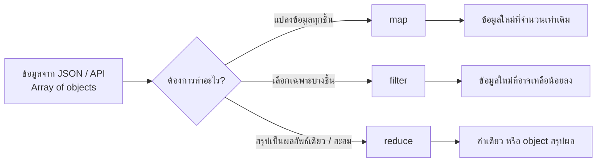
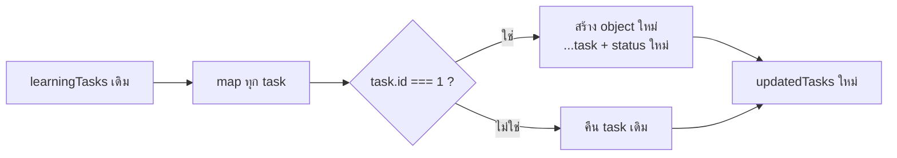
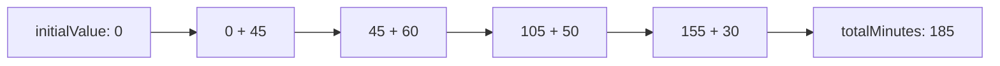
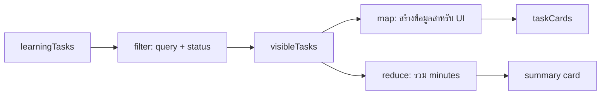

# Destructuring และ Array Methods ใน JavaScript: `map()` / `filter()` / `reduce()` พร้อมตัวอย่างและ Best Practices

เอกสารประกอบรายวิชา **ENGSE203 การเขียนโปรแกรมสำหรับวิศวกรซอฟต์แวร์**

> เป้าหมาย: อ่านและจัดการข้อมูลชนิด array/object ได้อย่างเป็นระบบ ใช้ destructuring เพื่อลดโค้ดซ้ำ ใช้ `map()` เพื่อแปลงข้อมูล ใช้ `filter()` เพื่อคัดเลือกข้อมูล และใช้ `reduce()` เพื่อสรุปหรือสะสมผลลัพธ์ โดยไม่แก้ไขข้อมูลต้นฉบับโดยไม่จำเป็น

---

## 1) ภาพรวม: ทำไมเรื่องนี้สำคัญกับเว็บแอปพลิเคชัน

เว็บแอปมักได้รับข้อมูลเป็น **array ของ object** จาก JSON หรือ API เช่นรายการงาน ผู้ใช้ สินค้า หรือคะแนนนักศึกษา

```js
const learningTasks = [
  { id: 1, title: "Modern JavaScript: ES6+", topic: "JavaScript", status: "todo", minutes: 45 },
  { id: 2, title: "ES Modules", topic: "Architecture", status: "doing", minutes: 60 },
  { id: 3, title: "Async/Await", topic: "JavaScript", status: "todo", minutes: 50 },
  { id: 4, title: "GitHub Pages", topic: "DevOps", status: "done", minutes: 30 },
];
```

สิ่งที่หน้าเว็บต้องทำกับข้อมูลชุดนี้มักอยู่ใน 3 กลุ่มหลัก



| ความต้องการของ UI | Method ที่เหมาะสม | ตัวอย่าง |
|---|---|---|
| แสดงชื่อ task ทุกตัวเป็นตัวพิมพ์ใหญ่ | `map()` | สร้างข้อมูลสำหรับ render card |
| แสดงเฉพาะ task ที่ยังไม่เสร็จ | `filter()` | ทำตัวกรอง status |
| คำนวณเวลารวมของ task | `reduce()` | สร้าง summary card |
| ดึง `title`, `status` ออกมาใช้ง่าย | destructuring | เขียน callback ให้อ่านง่าย |

---

## 2) Destructuring คืออะไร

**Destructuring** คือไวยากรณ์ที่ช่วย “แกะ” ค่าออกจาก object หรือ array แล้วเก็บลงในตัวแปรชื่อใหม่อย่างกระชับ

### 2.1 Object destructuring

#### เขียนแบบทั่วไป

```js
const task = {
  id: 2,
  title: "ES Modules",
  status: "doing",
  minutes: 60,
};

const title = task.title;
const status = task.status;

console.log(title, status); // ES Modules doing
```

#### เขียนด้วย destructuring

```js
const { title, status } = task;

console.log(title, status); // ES Modules doing
```

### 2.2 เปลี่ยนชื่อตัวแปรขณะ destructuring

ใช้เมื่อต้องการชื่อที่สื่อความหมายมากขึ้น หรือป้องกันชื่อชนกับตัวแปรอื่น

```js
const task = { title: "Async/Await", status: "todo" };

const { title: taskTitle, status: taskStatus } = task;

console.log(taskTitle);  // Async/Await
console.log(taskStatus); // todo
```

### 2.3 กำหนดค่าเริ่มต้น (default value)

ป้องกันกรณี property ไม่มีอยู่ในข้อมูล

```js
const task = { title: "GitHub Pages" };

const { status = "todo", minutes = 0 } = task;

console.log(status);  // todo
console.log(minutes); // 0
```

### 2.4 Nested destructuring

ใช้ได้เมื่อต้องเข้าถึงข้อมูลซ้อนกัน แต่ไม่ควรซ้อนลึกเกินไปจนอ่านยาก

```js
const task = {
  title: "ES Modules",
  owner: {
    name: "Anan",
    studentId: "66123456",
  },
};

const {
  owner: { name, studentId },
} = task;

console.log(name, studentId);
```

> ระวัง: หาก `owner` เป็น `undefined` โค้ดจะ error ได้ ในข้อมูลที่อาจไม่ครบ ให้ตรวจสอบก่อน หรือกำหนดโครงสร้างข้อมูลให้ชัดเจน

### 2.5 Array destructuring

```js
const statuses = ["todo", "doing", "done"];

const [firstStatus, secondStatus] = statuses;

console.log(firstStatus);  // todo
console.log(secondStatus); // doing
```

สามารถข้ามตำแหน่งและเก็บที่เหลือด้วย rest operator ได้

```js
const [todo, , done] = statuses;
const [first, ...remainingStatuses] = statuses;

console.log(todo, done);              // todo done
console.log(remainingStatuses);       // ["doing", "done"]
```

---

## 3) Destructuring ใน parameter ของ function

รูปแบบนี้พบมากใน callback ของ array methods เพราะช่วยให้เห็นชัดว่าฟังก์ชันใช้ property ใดบ้าง

### ก่อนใช้ destructuring

```js
function formatTask(task) {
  return `${task.title} (${task.minutes} minutes)`;
}
```

### ใช้ destructuring

```js
function formatTask({ title, minutes }) {
  return `${title} (${minutes} minutes)`;
}
```

ตัวอย่างกับ `filter()`

```js
const activeTasks = learningTasks.filter((task) => task.status !== "done");

const activeTasksReadable = learningTasks.filter(
  ({ status }) => status !== "done",
);
```

> Best practice: destructure เฉพาะ property ที่ใช้จริง เพื่อให้ function บอกเจตนาชัดเจน แต่ไม่จำเป็นต้อง destructure ทุกอย่างเสมอไป

---

## 4) Spread operator (`...`) กับการสร้างข้อมูลใหม่

เมื่อทำงานกับ object ใน Front-end ควรหลีกเลี่ยงการแก้ object ต้นฉบับโดยตรง หากต้องการปรับค่าให้สร้าง object ใหม่ด้วย spread operator

### ไม่แนะนำ: แก้ข้อมูลต้นฉบับโดยตรง

```js
const task = learningTasks[0];
task.status = "doing"; // เปลี่ยน object เดิมใน learningTasks ด้วย
```

### แนะนำ: สร้าง object ใหม่

```js
const task = learningTasks[0];
const updatedTask = { ...task, status: "doing" };

console.log(task.status);        // todo
console.log(updatedTask.status); // doing
```

### ใช้ร่วมกับ `map()` เพื่อ update รายการหนึ่งรายการ

```js
const updatedTasks = learningTasks.map((task) =>
  task.id === 1
    ? { ...task, status: "doing" }
    : task,
);
```



---

## 5) `map()`: แปลงข้อมูลทุกสมาชิก

### 5.1 หลักการ

`map()` จะเรียก callback กับสมาชิกทุกตัวใน array แล้วคืน **array ใหม่ที่มีจำนวนสมาชิกเท่าเดิม**

```js
const numbers = [1, 2, 3];
const doubledNumbers = numbers.map((number) => number * 2);

console.log(doubledNumbers); // [2, 4, 6]
console.log(numbers);        // [1, 2, 3]
```

### 5.2 ใช้ `map()` เมื่อใด

- แปลง data model เป็น view model สำหรับ UI
- สร้างข้อความ/HTML จากข้อมูล
- เพิ่มหรือปรับ property ของทุก object โดยสร้างข้อมูลใหม่
- แปลงหน่วย เช่น นาที → ข้อความเวลา

### 5.3 ตัวอย่าง: สร้างข้อมูลสำหรับแสดงผล

```js
const taskCards = learningTasks.map(({ id, title, topic, status, minutes }) => ({
  id,
  heading: title,
  meta: `${topic} • ${minutes} minutes`,
  statusLabel: status === "doing" ? "In progress" : status,
}));

console.log(taskCards);
```

ผลลัพธ์ตัวอย่าง

```js
[
  {
    id: 1,
    heading: "Modern JavaScript: ES6+",
    meta: "JavaScript • 45 minutes",
    statusLabel: "todo"
  },
  // ...
]
```

### 5.4 ตัวอย่าง: render HTML อย่างระวัง

```js
function renderTaskList(tasks) {
  return tasks
    .map(
      ({ title, topic, minutes }) => `
        <article class="task-card">
          <span class="tag">${topic}</span>
          <h2>${title}</h2>
          <p>${minutes} minutes</p>
        </article>
      `,
    )
    .join("");
}
```

> หมายเหตุด้านความปลอดภัย: หาก `title` หรือข้อความมาจากผู้ใช้โดยตรง ไม่ควรนำไปต่อเป็น `innerHTML` แบบไม่ผ่านการป้องกัน เพราะอาจเกิด XSS ได้ ใน LAB 2 ข้อมูลมาจาก JSON ที่ควบคุมเองจึงใช้เพื่อการเรียนรู้ได้

### 5.5 ข้อผิดพลาดที่พบบ่อย: ใช้ `map()` แต่ไม่ใช้ค่าที่คืนมา

```js
// ❌ ไม่เหมาะ: map มีไว้แปลงและคืน array ใหม่ แต่เราไม่ใช้ผลลัพธ์
learningTasks.map((task) => console.log(task.title));
```

หากต้องการวนทำ side effect เช่น `console.log()` ให้ใช้ `forEach()`

```js
// ✅ เหมาะกับ side effect
learningTasks.forEach((task) => console.log(task.title));
```

---

## 6) `filter()`: คัดเลือกเฉพาะสมาชิกที่ผ่านเงื่อนไข

### 6.1 หลักการ

`filter()` จะคืน **array ใหม่** ที่มีเฉพาะสมาชิกที่ callback คืนค่าเป็น `true`

```js
const numbers = [1, 2, 3, 4, 5];
const evenNumbers = numbers.filter((number) => number % 2 === 0);

console.log(evenNumbers); // [2, 4]
```

### 6.2 ตัวอย่าง: filter ตามสถานะ

```js
const activeTasks = learningTasks.filter(({ status }) => status !== "done");

console.log(activeTasks);
```

### 6.3 ตัวอย่าง: filter ตามคำค้นหาและสถานะ

นี่คือรูปแบบใกล้เคียงกับ LAB 2

```js
function filterTasks(tasks, { query = "", status = "all" }) {
  const normalizedQuery = query.trim().toLowerCase();

  return tasks.filter((task) => {
    const matchesQuery =
      task.title.toLowerCase().includes(normalizedQuery) ||
      task.topic.toLowerCase().includes(normalizedQuery);

    const matchesStatus = status === "all" || task.status === status;

    return matchesQuery && matchesStatus;
  });
}

const visibleTasks = filterTasks(learningTasks, {
  query: "java",
  status: "todo",
});

console.log(visibleTasks);
```

### 6.4 ทำไม `filter()` จึงไม่ควรแก้ข้อมูลต้นฉบับ

```js
const todoTasks = learningTasks.filter(({ status }) => status === "todo");

console.log(todoTasks.length);      // 2
console.log(learningTasks.length);  // 4 ยังเท่าเดิม
```

นี่คือข้อดีของการใช้ method ที่คืนค่าใหม่: UI สามารถสลับ filter ได้หลายครั้งโดยยังมีข้อมูลต้นฉบับอยู่ครบ

### 6.5 ข้อผิดพลาดที่พบบ่อย

```js
// ❌ ลืม return ใน callback ที่ใช้ { }
const todoTasks = learningTasks.filter((task) => {
  task.status === "todo";
});

console.log(todoTasks); // []
```

```js
// ✅ คืนค่าผลการเปรียบเทียบ
const todoTasks = learningTasks.filter((task) => {
  return task.status === "todo";
});

// ✅ หรือใช้ implicit return
const todoTasksShort = learningTasks.filter(
  (task) => task.status === "todo",
);
```

---

## 7) `reduce()`: สะสมข้อมูลเพื่อสร้างผลลัพธ์เดียว

### 7.1 หลักการ

`reduce()` ใช้รวมข้อมูลจาก array ให้กลายเป็น “ค่าเดียว” หรือ object สรุปผล โดยมีตัวสะสมชื่อ `accumulator` (มักย่อเป็น `acc` หรือเขียนเป็นชื่อที่สื่อความหมาย)

```js
const numbers = [10, 20, 30];

const total = numbers.reduce(
  (sum, number) => sum + number,
  0,
);

console.log(total); // 60
```

- `sum` คือ accumulator
- `number` คือสมาชิกปัจจุบัน
- `0` คือค่าเริ่มต้นของ accumulator (`initialValue`)

### 7.2 ภาพการทำงานของ reduce



### 7.3 ตัวอย่าง: คำนวณเวลารวมของ task ที่ยังไม่เสร็จ

```js
const activeTasks = learningTasks.filter(({ status }) => status !== "done");

const totalActiveMinutes = activeTasks.reduce(
  (sum, { minutes }) => sum + minutes,
  0,
);

console.log(totalActiveMinutes); // 155
```

### 7.4 ตัวอย่าง: สรุปจำนวนตาม status

```js
function getStats(tasks) {
  return tasks.reduce(
    (stats, { status }) => ({
      ...stats,
      total: stats.total + 1,
      [status]: (stats[status] ?? 0) + 1,
    }),
    { total: 0, todo: 0, doing: 0, done: 0 },
  );
}

console.log(getStats(learningTasks));
// { total: 4, todo: 2, doing: 1, done: 1 }
```

### 7.5 อ่าน reduce แบบทีละรอบ

| รอบ | status | stats ก่อน | stats หลัง |
|---:|---|---|---|
| 1 | `todo` | `{ total: 0, todo: 0, ... }` | `{ total: 1, todo: 1, ... }` |
| 2 | `doing` | `{ total: 1, todo: 1, ... }` | `{ total: 2, todo: 1, doing: 1, ... }` |
| 3 | `todo` | `{ total: 2, todo: 1, doing: 1, ... }` | `{ total: 3, todo: 2, doing: 1, ... }` |
| 4 | `done` | `{ total: 3, todo: 2, doing: 1, ... }` | `{ total: 4, todo: 2, doing: 1, done: 1 }` |

### 7.6 ทำไมต้องใส่ initial value

```js
// ✅ ควรใส่ 0 เสมอเมื่อรวมตัวเลข
const totalMinutes = learningTasks.reduce(
  (sum, task) => sum + task.minutes,
  0,
);
```

หากไม่ใส่ค่าเริ่มต้น และ array ว่าง `reduce()` จะ throw error ได้

```js
const emptyTasks = [];

// ❌ TypeError: Reduce of empty array with no initial value
emptyTasks.reduce((sum, task) => sum + task.minutes);
```

---

## 8) ใช้ `map()` + `filter()` + `reduce()` เป็น Data Pipeline

ตัวอย่างสถานการณ์: ผู้ใช้ค้นหา task คำว่า `java` เลือกสถานะ `todo` และหน้าเว็บต้องแสดง card พร้อมเวลารวม



```js
const filters = {
  query: "java",
  status: "todo",
};

const visibleTasks = filterTasks(learningTasks, filters);

const taskCards = visibleTasks.map(({ id, title, topic, minutes }) => ({
  id,
  heading: title,
  details: `${topic} • ${minutes} minutes`,
}));

const totalMinutes = visibleTasks.reduce(
  (sum, { minutes }) => sum + minutes,
  0,
);

console.log(taskCards);
console.log(totalMinutes); // 95
```

> แนวคิดสำคัญ: เริ่มจาก **ข้อมูลต้นฉบับ** → กรองข้อมูล → สร้างข้อมูลแสดงผล/สรุปผล โดยแต่ละขั้นคืนค่าใหม่และทำหน้าที่เดียว

---

## 9) เปรียบเทียบ `map()` / `filter()` / `reduce()` แบบจำง่าย

| Method | คำถามก่อนเลือกใช้ | ค่าที่คืนกลับ | จำนวนสมาชิก |
|---|---|---|---:|
| `map()` | “อยากแปลงทุกชิ้นหรือไม่?” | array ใหม่ | เท่าเดิม |
| `filter()` | “อยากเก็บเฉพาะชิ้นที่ผ่านเงื่อนไขหรือไม่?” | array ใหม่ | เท่าเดิมหรือน้อยลง |
| `reduce()` | “อยากสรุปหรือสะสมให้เหลือผลลัพธ์เดียวหรือไม่?” | ค่า/object ตาม accumulator | ไม่ใช่ array โดยอัตโนมัติ |

```js
const titles = learningTasks.map(({ title }) => title);
const todoTasks = learningTasks.filter(({ status }) => status === "todo");
const totalMinutes = learningTasks.reduce(
  (sum, { minutes }) => sum + minutes,
  0,
);
```

---

## 10) Best Practices สำหรับงาน ENGSE203

### 10.1 เก็บข้อมูลต้นฉบับไว้ และสร้างข้อมูลใหม่เมื่อ transform

```js
const visibleTasks = filterTasks(state.tasks, state);
```

ไม่ควร overwrite `state.tasks` ทุกครั้งที่ผู้ใช้ค้นหา เพราะจะทำให้ย้อนกลับไปแสดงข้อมูลทั้งหมดได้ยาก

### 10.2 ตั้งชื่อผลลัพธ์ให้บอกบทบาท

```js
const visibleTasks = filterTasks(allTasks, filters);
const taskCards = visibleTasks.map(toTaskCard);
const statusStats = getStats(allTasks);
```

หลีกเลี่ยงชื่อกว้างเกินไป เช่น `result`, `data2`, `newArray`

### 10.3 ใช้ method ให้ตรงเจตนา

```js
// ✅ transform
const labels = tasks.map(getStatusLabel);

// ✅ select
const activeTasks = tasks.filter(isActiveTask);

// ✅ aggregate
const totalMinutes = tasks.reduce(sumMinutes, 0);
```

### 10.4 แยก callback ที่มีตรรกะซับซ้อนออกเป็น function มีชื่อ

```js
function isActiveTask({ status }) {
  return status !== "done";
}

function sumMinutes(sum, { minutes }) {
  return sum + minutes;
}

const activeTasks = learningTasks.filter(isActiveTask);
const totalMinutes = activeTasks.reduce(sumMinutes, 0);
```

การตั้งชื่อ callback ช่วยให้อ่าน code pipeline ได้เหมือนประโยค

### 10.5 อย่า chain ยาวเกินจน debug ยาก

```js
// อ่านยากเมื่อเริ่มซับซ้อน
const total = tasks
  .filter(({ status }) => status !== "done")
  .map(({ minutes }) => minutes)
  .reduce((sum, minutes) => sum + minutes, 0);
```

```js
// อ่านและ debug ง่ายกว่า
const activeTasks = tasks.filter(({ status }) => status !== "done");
const activeMinutes = activeTasks.map(({ minutes }) => minutes);
const totalMinutes = activeMinutes.reduce((sum, minutes) => sum + minutes, 0);
```

> Chain สั้น ๆ ใช้ได้ดี แต่เมื่อมีเงื่อนไขหรือ logic หลายบรรทัด ให้แยกตัวแปรกลางเพื่อการสื่อสารและ debug

### 10.6 ตรวจข้อมูลที่อาจไม่ครบจาก API

```js
const safeMinutes = Number(task.minutes) || 0;
const safeTitle = task.title?.trim() || "Untitled task";
```

แต่ควรแก้ที่ต้นทางด้วย validation และกำหนด data contract ที่ชัดเจน ไม่ควรใช้ default เพื่อซ่อนข้อมูลผิดพลาดโดยไม่รู้ตัว

---

## 11) ตัวอย่างรวม: สร้างฟังก์ชันสำหรับ Learning Dashboard

```js
export function getStatusLabel(status) {
  const labels = {
    todo: "To do",
    doing: "In progress",
    done: "Done",
  };

  return labels[status] ?? "Unknown";
}

export function filterTasks(tasks, { query = "", status = "all" }) {
  const normalizedQuery = query.trim().toLowerCase();

  return tasks.filter((task) => {
    const matchesQuery =
      task.title.toLowerCase().includes(normalizedQuery) ||
      task.topic.toLowerCase().includes(normalizedQuery);

    const matchesStatus = status === "all" || task.status === status;
    return matchesQuery && matchesStatus;
  });
}

export function getStats(tasks) {
  return tasks.reduce(
    (stats, { status }) => ({
      ...stats,
      total: stats.total + 1,
      [status]: (stats[status] ?? 0) + 1,
    }),
    { total: 0, todo: 0, doing: 0, done: 0 },
  );
}

export function getTotalMinutes(tasks) {
  return tasks.reduce(
    (sum, { minutes = 0 }) => sum + minutes,
    0,
  );
}
```

การเรียกใช้

```js
const visibleTasks = filterTasks(learningTasks, {
  query: "",
  status: "all",
});

const stats = getStats(learningTasks);
const totalMinutes = getTotalMinutes(visibleTasks);

console.log(visibleTasks);
console.log(stats);
console.log(totalMinutes);
```

---

## 12) แบบฝึกหัดสั้น

ให้ใช้ข้อมูล `learningTasks` ชุดเดิม แล้วเขียนคำตอบตามข้อกำหนด

1. ใช้ `map()` สร้าง array ใหม่ที่มีเฉพาะชื่อหัวข้อของทุก task
2. ใช้ `filter()` เลือก task ที่มี `topic === "JavaScript"`
3. ใช้ `reduce()` หาจำนวนนาทีรวมของ task ที่มี status `todo`
4. ใช้ destructuring ใน parameter ของ function `formatTask()` เพื่อคืนข้อความรูปแบบ `"<title> — <minutes> minutes"`
5. เพิ่ม function `markTaskAsDone(tasks, taskId)` ที่คืน array ใหม่ โดยเปลี่ยนเฉพาะ task ที่ id ตรงกันเป็น `status: "done"`

### แนวคำตอบข้อ 5

```js
function markTaskAsDone(tasks, taskId) {
  return tasks.map((task) =>
    task.id === taskId
      ? { ...task, status: "done" }
      : task,
  );
}
```

---

## 13) Checklist ก่อนใช้ใน LAB 2

- [ ] ใช้ destructuring เฉพาะ property ที่ function ใช้จริง
- [ ] ใช้ `map()` เพื่อสร้าง/แปลง array ใหม่ ไม่ใช่เพื่อ `console.log()` อย่างเดียว
- [ ] ใช้ `filter()` เพื่อคัดเลือกข้อมูล และ return เงื่อนไขให้ครบ
- [ ] ใช้ `reduce()` พร้อม initial value ที่เหมาะสม เช่น `0` หรือ object เริ่มต้น
- [ ] ไม่แก้ object/array ต้นฉบับโดยไม่จำเป็น
- [ ] ตั้งชื่อตัวแปรกลางให้สื่อบทบาท เช่น `visibleTasks`, `taskCards`, `totalMinutes`
- [ ] ทดสอบกรณีไม่มีข้อมูล เช่น `[]` และกรณี filter แล้วไม่พบรายการ

---

## สรุป

> **Destructuring ช่วยอ่านข้อมูลได้ชัดขึ้น**  
> **`map()` ใช้แปลงทุกสมาชิก**  
> **`filter()` ใช้เลือกเฉพาะสมาชิกที่ผ่านเงื่อนไข**  
> **`reduce()` ใช้สะสมหรือสรุปผลลัพธ์**

ทั้งสี่แนวคิดนี้เป็นพื้นฐานสำคัญสำหรับการสร้าง UI จากข้อมูล JSON ใน Vanilla JavaScript และเป็นฐานโดยตรงสำหรับการจัดการ state และการ render component ใน React.js
