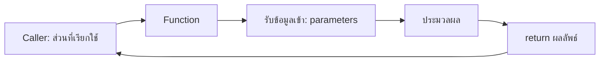
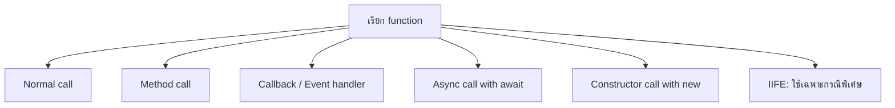
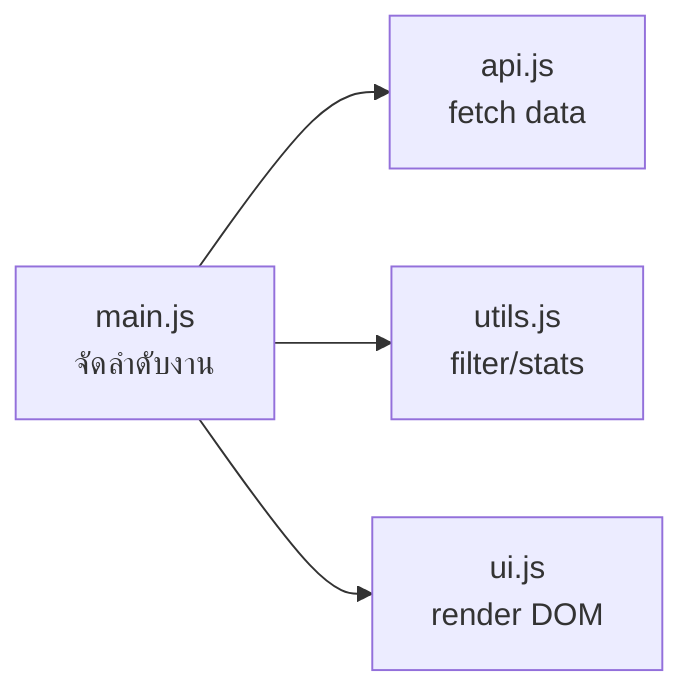

# JavaScript Functions และรูปแบบการเรียกใช้ พร้อม Best Practices

เอกสารประกอบรายวิชา **ENGSE203 การเขียนโปรแกรมสำหรับวิศวกรซอฟต์แวร์**

> เป้าหมาย: เข้าใจว่า function คืออะไร สร้างและเรียกใช้ได้หลายรูปแบบ เลือกใช้ให้เหมาะสม และเขียน function ที่อ่านง่าย ทดสอบง่าย และนำกลับมาใช้ซ้ำได้

---

## 1) Function คืออะไร

Function คือชุดคำสั่งที่ตั้งชื่อไว้เพื่อให้เรียกใช้ซ้ำได้ โดยรับข้อมูลเข้าได้ (parameter) ประมวลผล แล้วส่งผลลัพธ์กลับได้ (`return`)



```js
function calculateTotalMinutes(tasks) {
  return tasks.reduce((sum, task) => sum + task.minutes, 0);
}

const totalMinutes = calculateTotalMinutes([
  { minutes: 40 },
  { minutes: 60 },
]);

console.log(totalMinutes); // 100
```

### คำศัพท์สำคัญ

| คำ | ความหมาย | ตัวอย่าง |
|---|---|---|
| Function declaration | การประกาศฟังก์ชันด้วย `function` | `function greet() {}` |
| Parameter | ตัวแปรที่ function รับเข้ามา | `function greet(name)` |
| Argument | ค่าจริงที่ส่งตอนเรียก | `greet("Anan")` |
| Return value | ค่าที่ส่งกลับจาก function | `return message` |
| Invocation / Call | การเรียกให้ function ทำงาน | `greet("Anan")` |

---

## 2) Function Declaration: รูปแบบพื้นฐานที่อ่านง่าย

```js
function createGreeting(name) {
  return `Hello, ${name}!`;
}

console.log(createGreeting("Anan"));
```

### จุดเด่น

- อ่านง่ายสำหรับ function ที่มีชื่อชัดเจน
- ใช้ hoisting ได้: เรียกก่อนบรรทัดประกาศได้

```js
console.log(getStatusLabel("doing"));

function getStatusLabel(status) {
  return status === "doing" ? "In progress" : "Unknown";
}
```

> แม้ declaration จะ hoist ได้ แต่ในการเขียนโค้ดจริงควรวาง function ในตำแหน่งที่อ่านตามลำดับได้ง่าย ไม่ควรใช้ hoisting เพื่อทำให้โค้ดกระโดดไปมา

---

## 3) Function Expression: เก็บ function ไว้ในตัวแปร

```js
const createGreeting = function (name) {
  return `Hello, ${name}!`;
};

console.log(createGreeting("Anan"));
```

ต่างจาก declaration ตรงที่ต้องประกาศตัวแปรก่อนเรียกใช้

```js
// ❌ ReferenceError เพราะ createGreeting ยังไม่ได้ถูกกำหนดค่า
console.log(createGreeting("Anan"));

const createGreeting = function (name) {
  return `Hello, ${name}!`;
};
```

ในโค้ดสมัยใหม่ จะนิยม `function declaration` สำหรับ function หลักที่มีชื่อ และนิยม arrow function สำหรับ callback ขนาดสั้น

---

## 4) Arrow Function: กระชับ เหมาะกับ Callback

```js
const getStatusLabel = (status) => {
  const labels = {
    todo: "To do",
    doing: "In progress",
    done: "Done",
  };

  return labels[status] ?? "Unknown";
};
```

### เมื่อ function มี statement เดียว สามารถเขียนให้สั้นได้

```js
const square = (number) => number * number;
const isDone = (task) => task.status === "done";
```

### parameter เดียว ไม่ต้องใส่วงเล็บได้ แต่ใส่ไว้สม่ำเสมอมักอ่านง่ายกว่า

```js
const double = value => value * 2;
const doubleReadable = (value) => value * 2;
```

### เหมาะมากกับ array method

```js
const taskTitles = tasks.map((task) => task.title);
const activeTasks = tasks.filter((task) => task.status !== "done");
const totalMinutes = tasks.reduce(
  (sum, task) => sum + task.minutes,
  0,
);
```

---

## 5) Function ที่คืนค่า และ Function ที่ทำผลข้างเคียง

### Pure function: รับข้อมูลเข้า → คืนข้อมูลออก

```js
function getCompletedTasks(tasks) {
  return tasks.filter((task) => task.status === "done");
}
```

คุณสมบัติที่ดี

- ไม่แก้ข้อมูลต้นฉบับ
- ผลลัพธ์เดาได้จาก input
- ทดสอบง่าย
- ใช้ซ้ำง่าย

### Side effect function: ทำงานกับโลกภายนอก

```js
function renderMessage(element, message) {
  element.textContent = message;
}
```

ตัวอย่าง side effect อื่น ๆ

- แก้ DOM
- `console.log()`
- เรียก `fetch()`
- อ่าน/เขียน localStorage
- ส่งข้อมูลไป API

> แนวปฏิบัติที่ดี: แยก business logic ที่เป็น pure function ออกจาก DOM/API เพื่อให้ทดสอบง่าย

---

## 6) Parameter, Default Parameter, Rest Parameter และ Destructuring

### Default parameter

```js
function createTask(title, status = "todo") {
  return { title, status };
}

console.log(createTask("ES Modules"));
// { title: 'ES Modules', status: 'todo' }
```

### Rest parameter

```js
function calculateAverage(...scores) {
  const total = scores.reduce((sum, score) => sum + score, 0);
  return scores.length === 0 ? 0 : total / scores.length;
}

console.log(calculateAverage(80, 90, 100)); // 90
```

### Object destructuring parameter

```js
function formatTask({ title, topic, minutes }) {
  return `${title} (${topic}) — ${minutes} minutes`;
}

const task = {
  title: "Async/Await",
  topic: "JavaScript",
  minutes: 50,
};

console.log(formatTask(task));
```

ข้อดี: บอกชัดว่า function ใช้ property ใดบ้าง

ข้อควรระวัง: ถ้า argument อาจเป็น `undefined` ให้กำหนด default หรือ validate ก่อน

```js
function formatTask({ title = "Untitled", minutes = 0 } = {}) {
  return `${title}: ${minutes} minutes`;
}
```

---

## 7) รูปแบบการเรียกใช้ Function ที่สำคัญ



### 7.1 Normal function call

```js
function getGreeting(name) {
  return `Hello ${name}`;
}

const greeting = getGreeting("Anan");
```

### 7.2 Method call: เรียก function ที่เป็น property ของ object

```js
const task = {
  title: "GitHub Pages",
  markDone() {
    this.status = "done";
  },
  status: "todo",
};

task.markDone();
console.log(task.status); // done
```

ใน method แบบปกติ `this` อ้างถึง object ที่เรียก method นั้น (`task`)

### 7.3 Callback function: ส่ง function ให้ function อื่นเรียกภายหลัง

```js
const activeTasks = tasks.filter((task) => task.status !== "done");
```

`(task) => task.status !== "done"` คือ callback ที่ `filter()` เรียกให้ทีละรายการ

### 7.4 Event handler: browser เรียกเมื่อเกิดเหตุการณ์

```js
const searchInput = document.querySelector("#search");

searchInput.addEventListener("input", (event) => {
  console.log(event.target.value);
});
```

### 7.5 Async function call ด้วย `await`

```js
async function loadTasks() {
  const response = await fetch("/data/learning-tasks.json");
  return response.json();
}
```

```js
async function startDashboard() {
  const tasks = await loadTasks();
  console.log(tasks);
}

startDashboard();
```

### 7.6 Constructor call ด้วย `new`

```js
class LearningTask {
  constructor(title) {
    this.title = title;
  }
}

const task = new LearningTask("ES Modules");
```

### 7.7 IIFE: Immediately Invoked Function Expression

```js
(() => {
  console.log("Run once immediately");
})();
```

ปัจจุบันใช้ไม่บ่อยใน codebase ที่ใช้ ES Modules เพราะแต่ละ module มี scope ของตัวเองอยู่แล้ว

---

## 8) Arrow Function กับ `this`: จุดที่ต้องระวัง

Arrow function **ไม่มี `this` ของตัวเอง** แต่จะรับ `this` จาก scope ด้านนอก

```js
const task = {
  title: "Async/Await",
  showTitle: () => {
    console.log(this.title);
  },
};

task.showTitle(); // ไม่ได้อ้างถึง task ตามที่คาดหวัง
```

ให้ใช้ method shorthand หรือ function ปกติเมื่อจำเป็นต้องใช้ `this`

```js
const task = {
  title: "Async/Await",
  showTitle() {
    console.log(this.title);
  },
};

task.showTitle(); // Async/Await
```

### สรุปเลือกใช้

| สถานการณ์ | ควรใช้ |
|---|---|
| function หลักที่มีชื่อและเรียกหลายที่ | function declaration |
| callback ของ `map`, `filter`, `reduce` | arrow function |
| event handler ที่เป็น function สั้น | arrow function |
| object method ที่ใช้ `this` | method shorthand / function ปกติ |
| class behavior | class method |

---

## 9) Function หนึ่งควรทำ “หนึ่งหน้าที่หลัก”

### ตัวอย่างที่ทำหลายอย่างเกินไป

```js
function loadAndRenderAndLogTasks() {
  // fetch
  // filter
  // render HTML
  // update stats
  // console.log
}
```

### แยกความรับผิดชอบให้ชัด

```js
async function fetchLearningTasks() {
  const response = await fetch("/data/learning-tasks.json");

  if (!response.ok) {
    throw new Error(`HTTP ${response.status}`);
  }

  return response.json();
}

function filterTasks(tasks, { query, status }) {
  return tasks.filter((task) => {
    const matchesQuery = task.title
      .toLowerCase()
      .includes(query.toLowerCase());

    const matchesStatus = status === "all" || task.status === status;
    return matchesQuery && matchesStatus;
  });
}

function renderTasks(element, tasks) {
  element.innerHTML = tasks
    .map((task) => `<article>${task.title}</article>`)
    .join("");
}
```



ข้อดี

- แก้ไขง่าย: เปลี่ยน UI โดยไม่กระทบ logic
- ทดสอบง่าย: `filterTasks()` ทดสอบได้โดยไม่ต้องเปิด browser
- อ่านง่าย: ชื่อไฟล์และชื่อ function บอกบทบาท

---

## 10) Return early ลดการซ้อนของ if

### ก่อนปรับ

```js
function getTaskTitle(task) {
  if (task) {
    if (task.title) {
      return task.title;
    }
  }

  return "Untitled";
}
```

### ใช้ return early

```js
function getTaskTitle(task) {
  if (!task?.title) {
    return "Untitled";
  }

  return task.title;
}
```

ผลคือ flow ของ function ตรงขึ้น และลดระดับการเยื้องโค้ด

---

## 11) การตั้งชื่อ Function

Function ควรเริ่มด้วยคำกริยาและบอกสิ่งที่ทำ

| หน้าที่ | ชื่อที่แนะนำ |
|---|---|
| โหลดข้อมูล | `fetchLearningTasks`, `loadDashboard` |
| แปลงข้อมูล | `normalizeTask`, `formatTask` |
| คัดกรอง | `filterTasks` |
| สรุปข้อมูล | `getStats`, `calculateTotalMinutes` |
| แสดงผล | `renderTasks`, `setMessage` |
| ตรวจสอบ | `validateEmail`, `isValidTask` |
| สร้างข้อมูล | `createTask`, `buildRequestOptions` |
| จัดการ event | `handleSearchInput`, `handleRetryClick` |

ควรหลีกเลี่ยงชื่อกว้างเกินไป

```js
// ❌
function processData() {}
function handle() {}
function doThing() {}

// ✅
function filterTasksByStatus() {}
function handleStatusFilterChange() {}
function createLearningTaskSummary() {}
```

---

## 12) Error Handling ใน Function ที่โหลดข้อมูล

เมื่อ function ทำงานกับ network ควรคืน error ที่อธิบายได้ และผู้เรียกควรรับมือด้วย `try/catch`

```js
export async function fetchLearningTasks() {
  const response = await fetch("/data/learning-tasks.json");

  if (!response.ok) {
    throw new Error(`Unable to load tasks (HTTP ${response.status})`);
  }

  return response.json();
}
```

```js
async function loadDashboard() {
  try {
    setMessage("loading", "กำลังโหลดข้อมูล...");

    const tasks = await fetchLearningTasks();
    renderDashboard(tasks);

    setMessage("success", `โหลด ${tasks.length} รายการแล้ว`);
  } catch (error) {
    console.error(error);
    setMessage("error", `ไม่สามารถโหลดข้อมูลได้: ${error.message}`);
  } finally {
    console.log("Load attempt finished");
  }
}
```

---

## 13) Best Practices Checklist

### ก่อนเขียน

- Function นี้รับข้อมูลอะไร และคืนอะไร
- Function นี้ควรเป็น pure function หรือมี side effect
- มีชื่อที่เริ่มด้วยกริยาและบอกหน้าที่หรือไม่

### ระหว่างเขียน

- ให้ function หนึ่งทำงานหลักเพียงเรื่องเดียว
- ใช้ default parameter เมื่อต้องการค่าตั้งต้น
- ใช้ destructuring parameter เมื่อช่วยให้เห็น input ชัดขึ้น
- เลือก arrow function สำหรับ callback สั้น ๆ
- อย่าใช้ arrow function เป็น object method ถ้าต้องใช้ `this`

### หลังเขียน

- ทดสอบ input ปกติ, input ว่าง และ input ผิดรูปแบบ
- ตรวจว่าข้อมูลต้นฉบับไม่ถูกแก้โดยไม่ตั้งใจ
- ตรวจว่า caller รับมือ error ได้ หาก function มี network/file/DOM operation

---

## 14) แบบฝึกหัดสั้น

### ข้อ 1: แปลงเป็น arrow function

```js
function getTaskTitles(tasks) {
  return tasks.map(function (task) {
    return task.title;
  });
}
```

**แนวคำตอบ**

```js
const getTaskTitles = (tasks) => tasks.map((task) => task.title);
```

### ข้อ 2: แยก function ตามหน้าที่

```js
function showDoneTasks(tasks, element) {
  const doneTasks = tasks.filter((task) => task.status === "done");
  element.innerHTML = doneTasks.map((task) => `<li>${task.title}</li>`).join("");
}
```

**แนวคำตอบ**

```js
function getDoneTasks(tasks) {
  return tasks.filter((task) => task.status === "done");
}

function renderTaskList(element, tasks) {
  element.innerHTML = tasks.map((task) => `<li>${task.title}</li>`).join("");
}

function showDoneTasks(tasks, element) {
  renderTaskList(element, getDoneTasks(tasks));
}
```

---

## 15) สรุป

- Function ช่วยลดการเขียนซ้ำ แบ่งงาน และทำให้โค้ดทดสอบได้
- ใช้ declaration สำหรับ function หลัก, arrow function สำหรับ callback หรือ function สั้น
- เข้าใจรูปแบบการเรียกใช้: normal call, method, callback, event handler, async/await, constructor
- แยก pure logic ออกจาก DOM/API side effects
- ให้ function มีหน้าที่เดียว ชื่อเป็นคำกริยาที่ชัดเจน และคืนค่าที่เดาได้
- ระวัง `this` ใน arrow function โดยเฉพาะเมื่อเขียน object method
