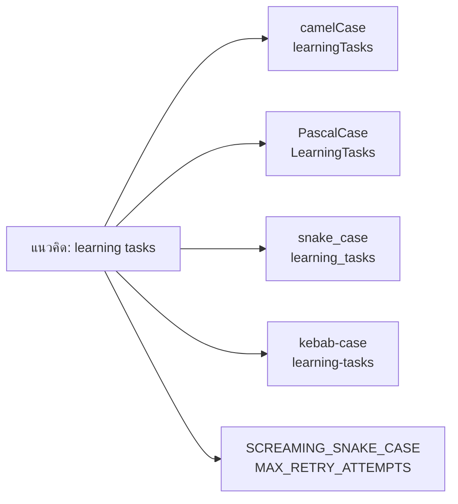
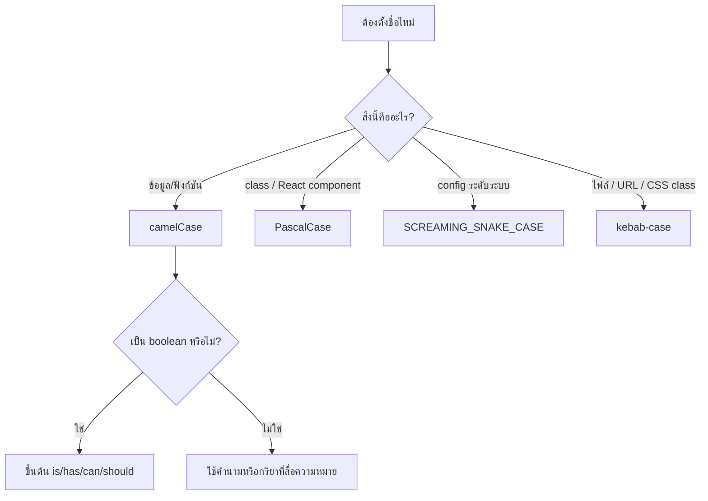

# การตั้งชื่อตัวแปร JavaScript: Case แบบต่าง ๆ พร้อม Best Practices

เอกสารประกอบรายวิชา **ENGSE203 การเขียนโปรแกรมสำหรับวิศวกรซอฟต์แวร์**

> เป้าหมาย: ตั้งชื่อตัวแปร ฟังก์ชัน คลาส ค่าคงที่ และไฟล์ JavaScript ให้สื่อความหมาย อ่านง่าย ค้นหาได้ง่าย และทำงานร่วมกับผู้อื่นได้ดี

---

## 1) ทำไม “ชื่อ” ของตัวแปรจึงสำคัญ

ชื่อที่ดีไม่ได้ช่วยแค่ให้โค้ดสวย แต่ช่วยให้ผู้อ่านเข้าใจว่า **ข้อมูลนี้คืออะไร ใช้ทำอะไร และเปลี่ยนได้หรือไม่** โดยไม่ต้องเปิดอ่านทุกบรรทัดของโค้ด

เปรียบเทียบตัวอย่างนี้

```js
const x = 3;
const a = users.filter((u) => u.active);
```

กับ

```js
const maxRetryAttempts = 3;
const activeUsers = users.filter((user) => user.isActive);
```

โค้ดชุดหลังอ่านแล้วเห็นเจตนาทันที จึงตรวจสอบ แก้ไข และทดสอบได้ง่ายกว่า

### หลักจำง่าย

> **ชื่อควรบอก “ความหมาย” ไม่ใช่บอกเพียง “ชนิดข้อมูล” หรือ “วิธีที่เราเขียนมัน”**

- ดี: `completedTasks`, `isLoading`, `fetchLearningTasks`
- ควรหลีกเลี่ยง: `data1`, `temp`, `arr`, `flag`, `function2`

---

## 2) ภาพรวมรูปแบบการตั้งชื่อ (Naming Case)



| รูปแบบ | ตัวอย่าง | ลักษณะ | ใช้ใน JavaScript เมื่อใด |
|---|---|---|---|
| `camelCase` | `learningTasks` | คำแรกตัวเล็ก คำถัดไปขึ้นต้นตัวใหญ่ | ตัวแปร ฟังก์ชัน พารามิเตอร์ และ property ส่วนใหญ่ |
| `PascalCase` | `LearningTask` | ทุกคำขึ้นต้นตัวใหญ่ | class, constructor, React component |
| `snake_case` | `learning_tasks` | คั่นคำด้วย `_` | มักพบในฐานข้อมูล, JSON/API จากระบบอื่น, Python; ไม่ใช่มาตรฐานหลักของ JS app |
| `kebab-case` | `learning-tasks` | คั่นคำด้วย `-` | ชื่อไฟล์, URL path, CSS class; ใช้เป็น identifier JS โดยตรงไม่ได้ |
| `SCREAMING_SNAKE_CASE` | `MAX_RETRY_ATTEMPTS` | ตัวใหญ่ทั้งหมด คั่นคำด้วย `_` | ค่าคงที่ระดับ configuration ที่ตั้งใจไม่ให้เปลี่ยน |
| `UPPERCASE` | `API` | ตัวใหญ่ทั้งคำ | คำย่อที่เป็นส่วนหนึ่งของชื่อ เช่น `apiBaseUrl`, `userId` |

---

## 3) camelCase: มาตรฐานหลักสำหรับตัวแปรและฟังก์ชัน

### รูปแบบ

```js
const studentName = "Anan";
const totalMinutes = 120;
let selectedStatus = "all";

function calculateTotalMinutes(tasks) {
  return tasks.reduce((sum, task) => sum + task.minutes, 0);
}
```

### ใช้กับอะไรบ้าง

- ตัวแปร: `learningTasks`
- ตัวแปรสถานะ: `isLoading`
- ฟังก์ชัน: `fetchLearningTasks()`
- พารามิเตอร์: `searchQuery`
- object property: `task.title`, `task.status`
- event handler: `handleSearchInput()`

### Best practice

```js
const filteredTasks = filterTasks(allTasks, filters);
const isDashboardReady = tasks.length > 0;
const hasNetworkError = error instanceof TypeError;
```

ชื่อควรเป็น “วลี” ที่อ่านได้ลื่น เช่น

```txt
isDashboardReady
hasNetworkError
canSubmitForm
shouldShowError
```

---

## 4) PascalCase: ใช้กับสิ่งที่สร้าง instance ได้หรือเป็น Component

### Class / Constructor

```js
class LearningTask {
  constructor({ id, title, status }) {
    this.id = id;
    this.title = title;
    this.status = status;
  }
}

const task = new LearningTask({
  id: 1,
  title: "ES Modules",
  status: "todo",
});
```

### React component (เตรียมความพร้อมสำหรับสัปดาห์ถัดไป)

```jsx
function TaskCard({ task }) {
  return <article>{task.title}</article>;
}
```

### ข้อควรจำ

- `LearningTask` = แม่แบบ / ประเภทของสิ่งของ
- `learningTask` = ข้อมูลหนึ่งรายการที่สร้างจากแม่แบบนั้น

```js
const learningTask = new LearningTask({ /* ... */ });
```

---

## 5) snake_case: เข้าใจไว้เพื่อทำงานข้ามระบบ

ใน JavaScript application สมัยใหม่มักเลือก `camelCase` เป็นหลัก แต่ `snake_case` พบได้บ่อยในฐานข้อมูล ระบบ backend บางภาษา หรือ API ภายนอก

```js
// ตัวอย่างข้อมูลที่อาจมาจาก database/API ภายนอก
const apiTask = {
  task_id: 1,
  created_at: "2026-07-06T09:00:00Z",
  is_completed: false,
};
```

เมื่อ Front-end ของเราใช้ `camelCase` อาจแปลงข้อมูลที่ขอบเขต API เพื่อให้ภายในโปรเจกต์สม่ำเสมอ

```js
function normalizeTask(apiTask) {
  return {
    id: apiTask.task_id,
    createdAt: apiTask.created_at,
    isCompleted: apiTask.is_completed,
  };
}
```

> หลักคิด: **เลือก convention หนึ่งสำหรับ codebase แล้วใช้ให้สม่ำเสมอ** ไม่จำเป็นต้องเปลี่ยนรูปแบบข้อมูลจาก external API ทุกครั้ง หากทีมกำหนดมาตรฐานอื่นไว้ชัดเจน

---

## 6) kebab-case: เหมาะกับชื่อไฟล์ URL และ CSS class

### ชื่อไฟล์

```txt
learning-tasks.json
check-project.mjs
vite.config.js
```

### URL path

```txt
/api/learning-tasks
/engse203-student-labs-66123456/labs/week-02/
```

### CSS class

```html
<article class="task-card task-card--done">
  ...
</article>
```

### ทำไมไม่ใช้เป็นชื่อ variable

เครื่องหมาย `-` ถูก JavaScript ตีความเป็นการลบ

```js
// ❌ JavaScript อ่านเป็น learning ลบ tasks
const learning-tasks = [];

// ✅ ใช้ camelCase สำหรับ identifier
const learningTasks = [];
```

---

## 7) SCREAMING_SNAKE_CASE: ค่าคงที่ที่เป็น “นโยบาย” หรือ “configuration”

ใช้กับค่าที่ทีมมองว่าเป็นค่าคงที่ระดับระบบ ไม่ใช่เพียงตัวแปรที่ประกาศด้วย `const`

```js
const MAX_RETRY_ATTEMPTS = 3;
const DEFAULT_API_TIMEOUT_MS = 5000;
const APP_NAME = "ENGSE203 Learning Dashboard";
```

### อย่าสับสนระหว่าง `const` กับ “constant แบบชื่อใหญ่”

```js
// เป็นค่าที่ reference ไม่เปลี่ยน แต่ข้อมูลภายในยังแก้ได้
const tasks = [];
tasks.push({ id: 1, title: "ES Modules" });

// เป็นค่ากำหนดกติกา/นโยบายระบบที่สื่อว่าไม่ควรแก้ระหว่างทำงาน
const MAX_RETRY_ATTEMPTS = 3;
```

สำหรับข้อมูลทั่วไป เช่น array, object, element DOM หรือผลลัพธ์จาก `fetch` ใช้ `camelCase` แม้ประกาศด้วย `const`

---

## 8) ตั้งชื่อ Boolean ให้ตอบได้เป็น Yes / No

Boolean ควรขึ้นต้นด้วยคำที่สื่อคำถาม

| รูปแบบที่แนะนำ | ตัวอย่าง | อ่านเป็นคำถามได้ว่า |
|---|---|---|
| `is...` | `isLoading` | กำลังโหลดอยู่หรือไม่ |
| `has...` | `hasError` | มี error หรือไม่ |
| `can...` | `canSubmit` | ส่งฟอร์มได้หรือไม่ |
| `should...` | `shouldRetry` | ควรลองใหม่หรือไม่ |
| `did...` | `didSave` | บันทึกสำเร็จแล้วหรือไม่ |

```js
const isLoading = true;
const hasValidEmail = email.includes("@");
const canPublish = isLoggedIn && hasValidEmail;
```

ควรหลีกเลี่ยงชื่อคลุมเครือ

```js
// ❌ ไม่รู้ว่า true หมายถึงอะไร
const flag = true;
const status = false;

// ✅ บอกความหมายตรง ๆ
const isMenuOpen = true;
const hasUnsavedChanges = false;
```

---

## 9) กติกาการตั้งชื่อที่ใช้ได้จริงใน LAB



### Checklist ก่อนตั้งชื่อ

- ชื่อนี้บอกได้หรือไม่ว่าข้อมูลคืออะไร
- คนอื่นอ่านแล้วเข้าใจได้โดยไม่เปิดดู implementation หรือไม่
- ถ้าเป็น function ชื่อเริ่มด้วยคำกริยาหรือไม่ เช่น `fetch`, `render`, `filter`, `create`
- ถ้าเป็น boolean ตอบคำถาม yes/no ได้หรือไม่
- ใช้รูปแบบเดียวกับ codebase หรือไม่
- ไม่มีชื่อสั้นเกินไป ยกเว้นตัวแปรในวงแคบที่ชัดเจน เช่น `i` ใน loop สั้น ๆ

---

## 10) ตัวอย่างจาก Learning Dashboard

```js
const state = {
  tasks: [],
  query: "",
  status: "all",
  isLoading: false,
  errorMessage: "",
};

function filterTasks(tasks, { query, status }) {
  const normalizedQuery = query.trim().toLowerCase();

  return tasks.filter((task) => {
    const matchesQuery =
      task.title.toLowerCase().includes(normalizedQuery) ||
      task.topic.toLowerCase().includes(normalizedQuery);

    const matchesStatus = status === "all" || task.status === status;
    return matchesQuery && matchesStatus;
  });
}
```

สังเกตว่า

- `state`, `tasks`, `query`, `status` เป็นคำนามแทนข้อมูล
- `isLoading` สื่อ Boolean ชัดเจน
- `filterTasks` เป็นคำกริยา + สิ่งที่จัดการ
- `normalizedQuery`, `matchesQuery` อธิบายขั้นตอนของข้อมูล

---

## 11) ตัวอย่างควรปรับปรุง

```js
// ❌ อ่านยากและไม่สื่อเจตนา
const d = [];
let x = false;
function doIt(a) {
  return a.filter((e) => e.s === "d");
}
```

```js
// ✅ อธิบายข้อมูลและเจตนา
const learningTasks = [];
let isFilterPanelOpen = false;

function getCompletedTasks(tasks) {
  return tasks.filter((task) => task.status === "done");
}
```

---

## 12) ข้อผิดพลาดที่พบบ่อย

### 12.1 ใช้ชื่อเดียวกันคนละความหมาย

```js
// ❌ task ใช้ทั้ง array และ object ทำให้อ่านสับสน
const task = [];
for (const task of task) {
  console.log(task.title);
}
```

```js
// ✅ ใช้พหูพจน์กับ collection และเอกพจน์กับหนึ่งรายการ
const tasks = [];
for (const task of tasks) {
  console.log(task.title);
}
```

### 12.2 ใช้ชื่อที่ผูกกับชนิดข้อมูลเกินจำเป็น

```js
// ❌ ถ้าวันหนึ่งเปลี่ยนจาก array เป็น Set ชื่อจะไม่ตรง
const taskArray = [];

// ✅ สื่อความหมายของข้อมูล
const tasks = [];
```

### 12.3 ใช้ตัวย่อที่ทีมไม่เข้าใจร่วมกัน

```js
// ❌
const usrCfg = {};

// ✅
const userConfig = {};
```

คำย่อที่ใช้ได้เมื่อเป็นมาตรฐานทั่วไป: `id`, `url`, `api`, `html`, `css`, `json`

---

## 13) แบบฝึกหัดสั้น

เปลี่ยนชื่อให้ชัดเจนขึ้น

```js
const a = tasks.filter((x) => x.status !== "done");
const b = a.reduce((s, x) => s + x.minutes, 0);
```

**แนวคำตอบ**

```js
const activeTasks = tasks.filter((task) => task.status !== "done");
const totalActiveMinutes = activeTasks.reduce(
  (totalMinutes, task) => totalMinutes + task.minutes,
  0,
);
```

---

## 14) สรุป

- ใช้ `camelCase` เป็นมาตรฐานหลักสำหรับ variable, function, parameter และ property
- ใช้ `PascalCase` สำหรับ class และ React component
- ใช้ `kebab-case` สำหรับไฟล์, URL และ CSS class
- ใช้ `SCREAMING_SNAKE_CASE` เฉพาะค่าคงที่ระดับ configuration หรือกติการะบบ
- Boolean ควรมี prefix เช่น `is`, `has`, `can`, `should`
- ชื่อที่ดีทำให้โค้ดอธิบายตัวเองได้ และลดภาระของคนที่ต้องอ่านโค้ดต่อจากเรา
